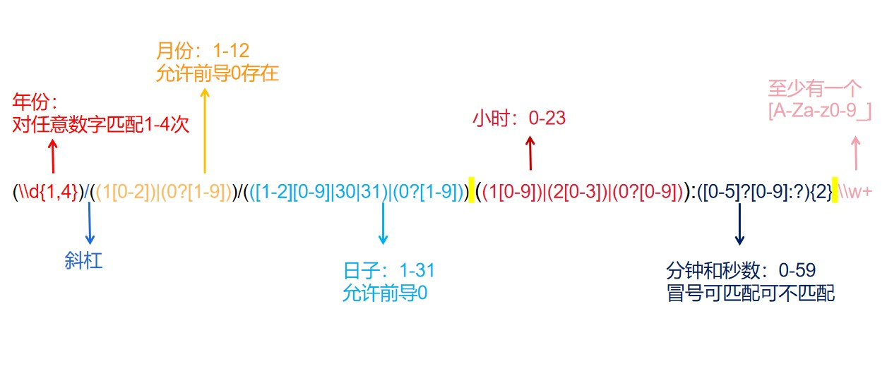

# 第四次作业指导书

## 第零部分：提交要求 && Junit要求

请保证提交项目的顶层目录存在两个文件夹：`src`和`test`（命名需严格与此保持一致），请将作业的**功能代码**存放于`src`文件夹下，同时将相关**junit测试类代码**文件存放于`test`文件夹下，以保证评测的正常进行（评测时**只会**针对`src`目录下的文件进行程序**功能**的评测以及代码风格检测，也就是说，`test`目录下的junit测试代码风格不会被检测）。参考目录结构如下：

```plaintext
|-src
  |- Bottle.java
  |- Equipment.java
  |- ...
|-test
  |- BottleTest.java
  |- EquipmentTest.java
  |- ...
```

本次作业，要求Junit测试覆盖率**保证**`method >= 90％`，`line >= 60%`，`branch >= 60%`。（`idea`显示的覆盖率和`评测`测到的覆盖率可能略有差别，请同学们以评测为准。同时请不要使用`assert`进行断言以免造成不必要的覆盖率损失）

## 第一部分：训练目标

- 对输入进行解析，掌握正则表达式的初步用法

## 第二部分：预备知识

在前几次作业中，课程组均提供了输入解析包供同学们使用。但在本次作业中，我们需要同学自己对输入进行读入和解析。这里我们引入两部分重要知识：**字符串处理**和**正则表达式**

## String类的应用  
Java中的每一个字符串对象也对应着一个`String`类的对象，因此Java提供了对字符串类操作的高效操作方式，接下来我们将介绍几个在本次作业会涉及到的重点方法。

### `split`
`split`方法是基于**正则表达式**进行字符串分割的方法，他会将按模式匹配后的字符串进行分割，将分割结果放在一个字符串数组中，数组大小即为分割数。

``` java 
public class Split {
    public void example() {
        String oo = "oo is the  best!!";
        String info = "age:23 height:180 weight:70";
        /* 使用空格进行字符串分割 */
        String[] group1 = oo.split(" ");
        System.out.println("Space Test");
        System.out.println("==========");
        for (String s : group1) {
            System.out.println(s);
        }
        System.out.println("-------------");
        /* 当匹配到 1至3个数字时 对字符串分割*/
        String[] group2 = info.split("[0-9]{1,3}"); // 关于正则表达式在第二部分会介绍
        System.out.println("Regex Test");
        System.out.println("==========");
        for (String s : group2) {
            System.out.println(s);
        }
    }
}
```

对上述程序运行的结果就是
``` txt
Space Test
==========
oo
is
the

best!!
-------------
Regex Test
==========
age:
 height:
 weight:
```


### `indexOf`
`indexOf`方法是用于获取字符/字符串位置的方法。
```java
public class IndexOf {
    public void example() {
        String str = "oo is the  best!!";
        /* 获取course的位置 */
        System.out.println("course 的位置是：" + str.indexOf("course")); // 没有course
        /* 获取 第一个 空格的位置 */
        System.out.println("第一个空格的位置是：" + str.indexOf(" "));
    }
}
```

输出
```txt
course 的位置是：-1
第一个空格的位置是：2
```

### `substring`
`substring`是用于获取字符串的子字符串的方法，按照所选位置切割原字符串从而获得子字符串。

```java
public class Substring {
    public void example () {
        String str = "oo is the  best course in the world!!";
        System.out.println(str.substring(3,9));
        System.out.println(str.substring(11));
    }
}
```

输出
```txt
is the
best course in the world!!
```

### `trim`
`trim`方法是用于删除字符串的头尾空白符的方法。

```java
public class Trim{
    public void example() {
        String str = " oo is the  best course in the world!!  ";
        
        System.out.println(str.trim());
    }
}
```

输出
``` txt
oo is the  best course in the world!!
```

## Java 正则表达式
正则表达式是一种强力的字符串结构化处理工具。正则表达式因具有以字符串的形式描述一个字符串集合的能力，故被频繁地用在字符串匹配等任务中。
正则表达式并不仅限于某一种语言，但是在每种语言中有细微的差别。我们只介绍在java中的相关知识。

### Java 正则匹配的基本步骤和概念介绍

Java 语言对正则表达式提供了多方面的支持。

+ Step1 创建一个正则表达式对象，创建 **Pattern 类**对象

```java
    Pattern pattern = Pattern.compile("一个字符串对象");
```

+ Step2 定义一个要匹配的字符串，创建 **String 类**对象

```java
    String str = "待匹配的字符串";
```

+ Step3 使用正则表达式进行匹配，创建 **Matcher 类**对象

```java
    Matcher mathcher = pattern.matcher(str);
```

+ Step4 处理匹配结果：使用 **Matcher 类** 的方法
  + 使用 find 方法可以实现在同一个字符串中使用正则表达式连续的进行匹配；
  + 使用 group 方法则可以从匹配中提取出与部分正则表达式相对应的子串；
  + 使用 start 、end 方法则可以获取匹配在目标字符串中的位置信息；
  + 使用 region 方法还可以限定正则表达式进行匹配的范围；

接下来以一个例子来介绍正则表达式在 Java 中的应用：

``` java 
import java.util.Scanner;
/* 导入java的正则表达式包 其中重要的2个类包是 Matcher和Pattern*/
import java.util.regex.Matcher;
import java.util.regex.Pattern;

public class Regex {
    public void example() {
        Scanner scanner = new Scanner(System.in);
        /* 在此我们先不纠结PATTERN被赋值的表达式的含义，在下文会解释 */
        String PATTERN = "(\\d{1,4})/((1[0-2])|(0?[1-9]))/(([1-2][0-9]|30|31)|(0?[1-9])) ((1[0-9])|(2[0-3])|(0?[0-9])):([0-5]?[0-9]:?){2} \\w+";

        /* 创建要匹配的模式 */
        Pattern pattern = Pattern.compile(PATTERN);
        while (scanner.hasNextLine()){
            String str = scanner.nextLine();
            System.out.println(str);
            /* 创建一个匹配“对象器” */
            Matcher matcher = pattern.matcher(str);
            /* 如果匹配成功 */
            if (matcher.find()) {
                /* 将匹配到的字符串进行分割 */
                for (String s : matcher.group().split(" ")) {
                    System.out.println(s);
                }
            } 
            /* 如果匹配失败 */
            else {
                System.out.println("not found");
            }
            System.out.println("=====================");
        }
    }
}
```

输入
``` txt
2023/7/12 23:54:12 Sunny
199/05/20 13:56:32
199/05/20 13:56:32 nonsense
```

输出
``` txt
2023/7/12 23:54:12 Sunny
2023/7/12
23:54:12
Sunny
=====================
199/05/20 13:56:32
not found
=====================
199/05/20 13:56:32 nonsense
199/05/20
13:56:32
nonsense
=====================
```

### 正则表达式

正则表达式的模式可以包括以下内容：
+ 字面值字符：例如字母、数字、空格等，可以直接匹配它们自身。
    > (hello world)  ---- hello world √ Hello world ×  
    > (12345) ---- 12345 √ 1234×

+ 特殊字符：例如点号 .、星号 *、加号 +、问号 ? 等，它们具有特殊的含义和功能。
  + **.** : 匹配除换行符 \n 之外的任何单字符。若匹配 **.** 本身，则需要在其前方加上两个反斜杠符号，形如`\\.` 。
    
    > (hello.rld) ----- hello world × hellowrld √  
    > (hello\\\\.world) ----- hello.world √ hello world × helloworld ×
    
  + **\***：匹配前面的子表达式零次或多次。若匹配 **\*** 本身，则需要在其前方加上两个反斜杠符号，形如`\\*`。
    
    > (hel\*o world) ----- helo world √ hello world √ heo world √  
    > (hello world)* ----- 空串 √ hello world √ hello worldhello world √
    
  + **\+**：匹配前面的子表达式一次或多次。要匹配 **\+** 本身，则需要在其前方加上两个反斜杠符号，形如 `\\+`。
    > (hel+o world) ----- helo world √ hello world √ heo world ×  
    > (hello world)+ ----- 空串 × hello world √ hello worldhello world √
  
  + **?**：匹配前面的子表达式零次或一次。要匹配 **?** 本身，则需要在其前方加上两个反斜杠符号，形如 `\\?`。
    > (hel?o world) ----- helo world √ hello world × heo world √  
    > (hello world)? ----- 空串 √ hello world √ hello worldhello world ×
  
  + **{}**：标记限定符表达式。要匹配 **{** 本身，则需要在其前方加上两个反斜杠符号，形如`\\{`, `\\}`：
    > (hello{3}) ----- hellooo √ hello ×  
    > (hello{1,}) ----- hello √ helloo √   
    > (hello{1,3}) ----- hello √ helloo √ hellooo √ 
  
+ 字符类：用方括号 [ ] 包围的字符集合，用于匹配方括号内的任意一个字符。
    > ([123]{2}) --- 11 √ 12 √ 13 √ 21 √ 22 √ 34 ×

+ 元字符：例如 \\d、\\w、\\s 等，用于匹配特定类型的字符，如数字、字母、空白字符等。
  + \\w: 匹配**一个**字，包括大小写字母，数字和下划线，等价于[0-9a-zA-Z_]
    > \\w+ ----- a √ 123 √ 2024O_o √
  + \\d: 匹配**一个**数字，等价于[0-9]
    > \\d+ ----- 1 √ 123 √  

最后我们解析一下上面给的例子里的正则



正则表达式是十分强大的工具，我们鼓励同学自己课下进行更多的学习！
> 正则表达式 [菜鸟教程1](https://www.runoob.com/regexp/regexp-tutorial.html)

> java正则 [菜鸟教程2](https://m.runoob.com/java/java-regular-expressions.html)

### 捕获组

在上面的代码中，我们看到了一个这样的类：`Matcher matcher` 现对其进行说明。

你可以这样理解，` Matcher matcher = pattern.matcher(str);`这行代码，创造了一个新的 matcher 对象，这个对象，**将**以 pattern 为模式，在 str 里面去搜索符合 pattern 的内容。

#### macher.find()

这个方法的意义是，尝试查找与该模式匹配的输入序列的下一个子序列，该方法返回一个 bool 值，代表是否成功查找。

例如

```java
String PATTERN = "(\\D*)(\\d+)";
Pattern pattern=Pattern.compile(PATTERN);
Matcher matcher1 = pattern.matcher("java666");
Matcher matcher2 = pattern.matcher("abcabc");
if(matcher1.find()){
    System.out.println("Yes");
}
else{
    System.out.println("No");
}
if(matcher2.find()){
    System.out.println("Yes");
}
else{
    System.out.println("No");
}

```

显然第一个是符合 pattern 的，第二个不符合，所以输出会是前者 yes 后者 no

#### matcher.group()

判断符不符合 pattern 后，更有意义的应用是按照 pattern 提取出字符串中的信息。这里我们着重介绍 `group()`

`(\\D*)(\\d+)`

在这个字符串中，我们会发现其中有两个括号，这个括号，不会作为字符被 matcher 比较，它的作用是，一个括号包裹为一个 group ，这样在匹配后，可以容易的取出匹配到的对应内容。

继续看这个例子：

```java
String PATTERN = "(\\D*)(\\d+)";
Pattern pattern=Pattern.compile(PATTERN);
Matcher matcher = pattern.matcher("java666");
if(matcher.find()){
	System.out.println(matcher.group());
	System.out.println(matcher.group(0));
	System.out.println(matcher.group(1));
    System.out.println(matcher.group(2));
}
```

当成功匹配后，通过 matcher 的 group 方法可以获取其中不同括号中的内容。

- group() 和 group(0)，效果一样，都是直接返回匹配到的符合 pattern 的子字符串
- group(i)（i为整数，需要保证有这么多的组），代表第 i 个括号里面的字符串内容

输出应当为：

```
java666
java666
java
666
```

需要明确的是，不能在没有 `matcher.find()` 的情况下使用 `group()` 方法：

```java
Exception in thread "main" java.lang.IllegalStateException: No match found
	at java.util.regex.Matcher.group(Matcher.java:536)
	at java.util.regex.Matcher.group(Matcher.java:496)
```

这一点下面解释

#### find

需要指出的是，就像 find 是一个动词一样，`matcher.find()`，不是一个判断方法，而是一个执行方法，它的返回值是它执行后成功与否的结果，而不是它是否能被按照 pattern 匹配。

同时，上面说到，它的意义是, **尝试查找与该模式匹配的输入序列的下一个子序列**，注意是下一个。

那么我们更改一下情景。

```java
String PATTERN = "(\\D*)(\\d+)";
Pattern pattern=Pattern.compile(PATTERN);
Matcher matcher = pattern.matcher("java666python777");
if(matcher.find()){
	System.out.println(matcher.group());
    System.out.println(matcher.group(0));
    System.out.println(matcher.group(1));
    System.out.println(matcher.group(2));
   }
```

事实上，输出还是

```java
java666
java666
java
666
```

这代表了，对于初始状态的 matcher ，没有执行 `find()` 的时候，它的下一个 **与该模式匹配的输入序列的子序列**是 java666

更改一下执行步骤：

```java
String PATTERN = "(\\D*)(\\d+)";
Pattern pattern=Pattern.compile(PATTERN);
Matcher matcher = pattern.matcher("java666python777");
while(matcher.find()){
      System.out.println(matcher.group());
      System.out.println(matcher.group(0));
      System.out.println(matcher.group(1));
      System.out.println(matcher.group(2));
     }
```

换成了 while, 则输出是：

```java
java666
java666
java
666
python777
python777
python
777
```

会把所有全部捕获。在使用 `find()` 的时候，应当注意其“下一个”的特性。

## 第三部分：题目描述

### 背景

本次作业仍将基于 第2次作业 与 第3次作业 的内容开发，同学们应当在实现前序题目所要求内容的前提下基于前序作业的代码完成本次作业。

在本次作业中，我们将引入战斗模式与战斗日志（FightLog）的概念。

在战斗模式中，冒险者能且仅能发起攻击或使用药水，并且保证战斗模式结束后所有进入战斗模式的冒险者体力均大于 0。

- 战斗模式中使用药水，可以实现冒险者体力的增加，具体使用要求同前序作业中关于药水使用的定义。
- 战斗模式中发起攻击，分为一对一攻击，和一对多攻击，可以实现被攻击冒险者体力的减少，具体的计算公式和输入格式将在后文给出。

同时我们引入战斗日志的查询功能，主要包括查询某日期的战斗日志，查询某冒险者发起攻击的日志，查询某冒险者受到攻击的日志。

在本次作业中，你需要实现的任务是：

- 在第三次作业的基础上完成战斗模式中冒险者相关属性的增减。
- 实现战斗模式与战斗日志的记录与查询功能。


**注意：冒险者的名字保证唯一，药水瓶、装备和食物的名字均可以重复**

### 操作要求

在本次作业中，初始时，你没有需要管理的冒险者，我们通过若干条操作指令来修改当前的状态：

（**对于第1-13条，若无特殊说明，则要求和限制同第三次作业**）

1. 加入一个需要管理的冒险者（新加入的冒险者不携带任何瓶子和装备，并且等级为1，初始血量为500）
2. 给某个冒险者增加一个瓶子
3. 删除某个冒险者的某个瓶子
4. 给某个冒险者增加一个装备
5. 删除某个冒险者的某个装备
6. 给某个冒险者的某个装备提升一个星级
7. 给冒险者增加一个食物
8. 删除冒险者的一个食物
9. 冒险者尝试携带他拥有的某件装备
10. 冒险者尝试携带他拥有的某瓶药水
11. 冒险者尝试携带他拥有的某个食物
12. 冒险者使用某瓶药水
13. 冒险者使用某个食物
14. 指定部分冒险者进入战斗模式及战斗模式中所发生的事件
15. 查询战斗模式下某日期发生的事件
16. 查询战斗模式下某冒险者发起的攻击
17. 查询战斗模式下某冒险者受到的攻击


#### 战斗模式下受到攻击时体力减少量的计算

被攻击者体力的减少量为攻击者使用的武器的**星级** * 攻击者的**等级**（一对一攻击和一对多攻击均如此计算）：
`{healthPoint_decrease = star * level}`

### 输入格式

第一行一个整数 **n**，表示操作的个数。

接下来的 n 个指令，每条指令占一行，是一个形如 `{type} {attribute}` 的操作，`{type}` 和 `{attribute}` 间、若干个 `{attribute}` 间使用**若干**个空格分割，操作输入形式及其含义如下。战斗日志的内容同样每条占一行，但是**注意战斗日志内容不属于指令，指令数目n中不包含战斗日志占有的行数**

在**操作14中**，除了本身的指令占一行外，其余的fightLog每条占一行。保证操作14除了fightLog外所有`{type}` `{attribute}`均在一行内

| type | attribute                                          | 意义                                                         | 输出（每条对应占一行）                                       |
| ---- | -------------------------------------------------- | ------------------------------------------------------------ | ------------------------------------------------------------ |
| 1    | `{adv_id} {name}`                                  | 加入一个 ID 为 `{adv_id}`、名字为 `{name}` 的冒险者  （新加入的冒险者不携带任何瓶子和装备，并且等级为1，初始血量为500） | 无                                                           |
| 2    | `{adv_id} {bot_id} {name} {capacity}`              | 给 ID 为 `{adv_id}` 的冒险者增加一个药水瓶，药水瓶的 ID、名字、容量分别为 `{bot_id}`、`{name}`、`{capacity}`，**且默认为已装满**(`isEmpty`==`false`) | 无                                                           |
| 3    | `{adv_id} {bot_id}`                                | 将 ID 为 `{adv_id}` 的冒险者的 id 为 `{bot_id}` 的药水瓶删除 | `{一个整数} {一个字符串}`，整数为删除后冒险者药水瓶数目，字符串为删除的药水瓶的name |
| 4    | `{adv_id} {equ_id} {name} {star}`                  | 给 ID 为 `{adv_id}` 的冒险者增加一个装备，装备的 ID、名字、星级分别为 `{equ_id}`、`{name}`、`{star}` | 无                                                           |
| 5    | `{adv_id} {equ_id}`                                | 将 ID 为 `{adv_id}` 的冒险者的 id 为 `{equ_id}` 的装备删除   | `{一个整数} {一个字符串}`，整数为删除后冒险者装备数目，字符串为删除的装备的name |
| 6    | `{adv_id} {equ_id}`                                | 将 ID 为 `{adv_id}` 的冒险者的 id 为 `{equ_id}` 的装备提升一个星级 | `{一个字符串} {一个整数}`，字符串为装备的name，整数为装备升星后的星级 |
| 7    | `{adv_id} {food_id} {name} {energy}`               | 给 ID 为 `{adv_id}` 的冒险者增加一个食物，食物的 ID、名字、能量分别为 `{equ_id}`、`{name}`、`{energy}` | 无                                                           |
| 8    | `{adv_id} {food_id}`                               | 将 ID 为 `{adv_id}` 的冒险者的 id 为 `{food_id}` 的食物删除  | `{一个整数} {一个字符串}`，整数为删除后冒险者食物数目，字符串为删除的食物的name |
| 9    | `{adv_id} {equ_id}`                                | ID 为 `{adv_id}` 的冒险者尝试携带ID为 `{equ_id}` 的装备      | 无                                                           |
| 10   | `{adv_id} {bot_id}`                                | ID 为 `{adv_id}` 的冒险者尝试携带ID为 `{bot_id}` 的瓶子      | 无                                                           |
| 11   | `{adv_id} {food_id}`                               | ID 为 `{adv_id}` 的冒险者尝试携带ID为 `{food_id}` 的食物     | 无                                                           |
| 12   | `{adv_id} {name}`                                  | ID 为 `{adv_id}` 的冒险者尝试使用名字为`{name}`的药水瓶      | 成功：`{一个整数A} {一个整数B}`，整数A为该被使用药水瓶的id，整数B为该冒险者使用该药水瓶后的体力值<br/> 失败： `fail to use {name}`(其中name为输入中的name) |
| 13   | `{adv_id} {name}`                                  | ID 为 `{adv_id}` 的冒险者尝试使用名字为`{name}`的食物        | 成功：`{一个整数A} {一个整数B}`，整数A为该食物的id，整数B为该冒险者使用该食物后的等级<br/> 失败：`fail to eat {name}`(其中name为输入中的name) |
| 14   | `m k {adv_name_1} {adv_name_2} ` ...`{adv_name_m}` | `m` 为进入战斗模式的人数，`k` 为此次战斗模式下战斗日志的条数，name 为 `{adv_name_j}` 的冒险者进入战斗模式，(m、k和name在一行)接下来的 `k` 行均为战斗日志 | 首先第一行输出 `Enter Fight Mode` ，接下来 k 行输出 k 条战斗日志的反馈，参见下文关于战斗日志输出的表格 |
| 15   | `YYYY/MM`                                          | 查询在 `YYYY/MM` 发生的有效战斗日志                          | 按输入顺序每条日志输出一行：使用药水：`YYYY/MM {adv_name_1} used {name}`、一对一攻击：`YYYY/MM {adv_name_1} attacked {adv_name_2} with {name}`、一对多攻击：`YYYY/MM {adv_name_1} AOE-attacked with {name}`。如果不存在符合条件的日志，输出`No Matched Log` |
| 16   | `adv_id`                                           | 查询 id 为 `adv_id` 的冒险者在战斗模式下作为**攻击者**的有效战斗日志 | 按输入顺序每条日志输出一行：一对一攻击：`YYYY/MM {adv_name_1} attacked {adv_name_2} with {name}`、一对多攻击：`YYYY/MM {adv_name_1} AOE-attacked with {name}`。如果不存在符合条件的日志，输出`No Matched Log` |
| 17   | `adv_id`                                           | 查询 id 为 `adv_id` 的冒险者在战斗模式下作为**被攻击者**的有效战斗日志 | 按输入顺序每条日志输出一行：一对一攻击：`YYYY/MM {adv_name_1} attacked {adv_name_2} with {name}`、一对多攻击：`YYYY/MM {adv_name_1} AOE-attacked with {name}`。如果不存在符合条件的日志，输出`No Matched Log` |

**注意** 

- 15/16/17中输出中的空白部分均应为一个空格！
- 15/16/17中，adv_name_1代表对应战斗日志中使用药水瓶的冒险者/攻击者的name，adv_name_2代表对应战斗日志中被攻击者的name，with {name} 指该战斗日志使用的武器的name
- 在AOE-attacked的输出中，不体现本条战斗日志的被攻击者。


#### 关于战斗日志的具体说明

| 输入格式                                   | 意义                                                         | 输出格式                                                     |
| ------------------------------------------ | ------------------------------------------------------------ | ------------------------------------------------------------ |
| `YYYY/MM-{adv_name_1}-{name}`              | 在 `YYYY/MM`这个月，名字为 `{adv_name_1}` 的冒险者使用了名字为 `{name}` 的药水 | 成功：`{一个整数A} {一个整数B}`，整数A为该被使用药水的id，整数B为该冒险者使用该药水后的体力值                                                                                失败： `Fight log error` |
| `YYYY/MM-{adv_name_1}@{adv_name_2}-{name}` | 在 `YYYY/MM`这个月，名字为 `{adv_name_1}` 的冒险者对名字为 `{adv_name_2}` 的冒险者发起攻击，使用了名字为 `{name}` 的装备 | 成功：`{一个整数A} {一个整数B}`，整数A为**被攻击者**的id，整数B为该冒险者受到攻击后的体力值                                                                                失败： `Fight log error` |
| `YYYY/MM-{adv_name_1}@#-{name}`            | 在 `YYYY/MM`这个月，名字为 `{adv_name_1}` 的冒险者对剩余所有进入战斗模式的冒险者发起群体攻击，使用了名字为 `{name}` 的装备 | 成功：按照  进入战斗状态 的次序输出受攻击冒险者被攻击后的体力值，以一个空格隔开                                                      失败： `Fight log error` |

上述 "Fight log error" 的输出场景为：**非法冒险者名**（冒险者不处于战斗模式）、**非法药水名**（该药水未被携带）、**非法武器名**（该武器未被携带）。保证战斗日志不会出现其他形式的错误。一旦出现错误，**则该行战斗日志无效**，不产生任何作用，同时 **不应出现在15/16/17号命令的查询中**

特别地，对于一对多攻击，只要出现上述错误场景，视这条战斗日志无效，所有被攻击者均不会损失体力。

`YYYY/MM`代表输入的字符串位数必然为4位数字/2位数字，你在输出的时候也应当采取这样的格式

保证实际月份值在1-12月之间。

**特别提醒**：在有些程序的实现里，从字符匹配角度来看，一个战斗日志可能既符合`YYYY/MM-{adv_name_1}-{name}`也符合`YYYY/MM-{adv_name_1}@{adv_name_2}-{name}`，但是在**数据限制**的情况下有唯一意义，请思考这一点并将其应用于你的程序

### 样例

##### 输入

```
8
1 123 advName1
1 124 advName2
1 125 advName3
4 124 1 equName 20
2 123 2 botName 10
10 123 2
14 3 2 advName1 advName2 advName3
2022/09-advName1-botName
2022/09-advName2@#-equName
15 2022/09
```

##### 输出

```
Enter Fight Mode
2 510
Fight log error
2022/09 advName1 used botName
```

### 数据限制

##### 变量约束

| 变量       | 类型   | 说明                                |
| ---------- | ------ | ----------------------------------- |
| `id `      | 整数   | 取值范围：0 - 2147483647            |
| `name`     | 字符串 | 保证不会出现空白字符, `@`, `-`, `#`;长度区间: (0,40) |
| `capacity` | 整数   | 取值范围：1 - 2147483647            |
| `star`     | 整数   | 取值范围：0 - 2147483647            |
| `level`    | 整数   | 取值范围：1 - 2147483647            |
| `hitPoint` | 整数   | 取值范围：1 - 2147483647            |
| `energy`   | 整数   | 取值范围： 0 - 2147483647             |

表格中a-b指变量范围为[a,b]

注意，变量约束指的是，在程序正确运行时，输入和对应属性值均保证在表格中给出的范围内。

##### 操作约束

1. **保证所有的冒险者、药水瓶、装备、食物 id 均不相同，冒险者之间name均不相同**
2. 保证删除了的药水瓶/装备/食物的 id 不会再次出现
3. 2-6/14/16-17保证所有 id 对应的冒险者均已存在
4. 3/5/6/8保证该冒险者拥有操作中提到 id 的药水瓶/装备/食物
5. 保证增加的装备，食物和药水瓶原本不存在
6. 操作数满足1≤*n*≤2000
7. 9-11保证该冒险者拥有操作中提到 id 的药水瓶/装备/食物
8. 12-13 **不**保证以提到的 name 为名字的物品已经被携带
9. 14保证战斗模式结束时，任意一个冒险者的体力均大于0
10. 保证战斗日志出现的时候一定处于战斗模式
11. 同一次战斗模式下，保证日志输入中日期随输入顺序**单调不减**；如果多次进入战斗模式，进入战斗模式的日期也随输入顺序**单调不减**
12. 保证 14 中所有 提到的冒险者name均存在
