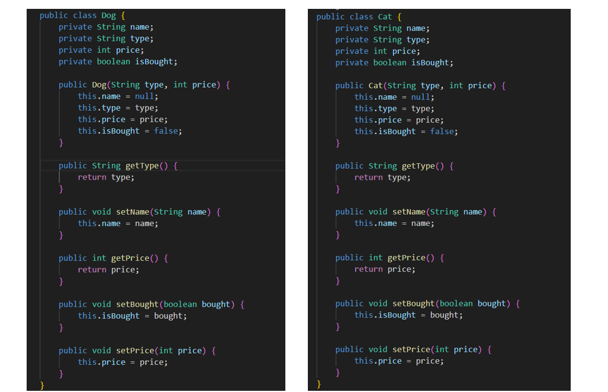
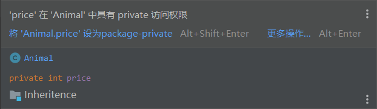

# 第六次作业指导书

## 第零部分：提交要求 && Junit要求

请保证提交项目的顶层目录存在两个文件夹：`src`和`test`（命名需严格与此保持一致），请将作业的**功能代码**存放于`src`文件夹下，同时将相关**junit测试类代码**文件存放于`test`文件夹下，以保证评测的正常进行（评测时**只会**针对`src`目录下的文件进行程序**功能**的评测以及代码风格检测，也就是说，`test`目录下的junit测试代码风格不会被检测）。参考目录结构如下：

```plaintext
|-src
  |- Bottle.java
  |- Equipment.java
  |- ...
|-test
  |- BottleTest.java
  |- EquipmentTest.java
  |- ...
```

本次作业，要求Junit测试覆盖率**保证**`method >= 90％`，`line >= 60%`，`branch >= 60%`。（`idea`显示的覆盖率和`评测`测到的覆盖率可能略有差别，请同学们以评测为准。同时请不要使用`assert`进行断言以免造成不必要的覆盖率损失）

## 第一部分：训练目标

- 掌握继承以及接口的使用

## 第二部分：预备知识

面向对象编程有三大特征，**封装性**、**继承性**、**多态性**。

## 继承
想要了解继承，我们还是把目光放回我们的宠物商店……
宠物商店之前只卖狗，但现在它还卖猫了



通过观察，我们发现猫和狗的代码长得几乎一样。他们的属性都包括名字 name，种类 type，价格 price，是否被购买 isBought。同时他们的行为（方法）是高度相近的。如果不对这种情况做修改，就会产生大量重复的不必要的代码。此时正确的做法是：共性提取！

### 继承的概念
**<font color='lightgreen'>继承</font>** 就是子类继承父类的特征和行为，使得子类具有父类的属性和方法。子类的创建可以增加新数据、新功能，可以继承父类全部的功能，但是不能选择性的继承父类的部分功能。通过继承，可以起到代码复用的目的。

### 继承的格式
我们根据Cat和Dog的特性，抽象出一个 **Animal** 类：
``` java
public class Animal {
    private String name;
    private String type;
    private int price;
    private boolean isBought;

    public Animal(String type, int price) {
        this.name = null;
        this.type = type;
        this.price = price;
        this.isBought = false;
    }

    public int getPrice() {
        return price;
    }

    public String getType() {
        return type;
    }
}
```
此时 Animal 类即父类，Cat 和 Dog 作为子类继承了父类
基本格式如下：
``` java
public class Child extends Parent {
    /* ... */
}
```
对应到我们的例子中即：
``` java
public class Dog extends Animal{

    public Dog(String type, int price) {
        super(type, price);
    }

    /* ... */
}
```
``` java
public class Cat extends Animal{

    public Cat(String type, int price) {
        super(type, price);
    }
    
    /* ... */
}
```
> *super*关键字的使用：super可以理解为 **父类的**，就像this可以理解为**当前类**的(也就是继承关系中的子类)，super可以用来调用属性、方法、构造器。对于构造器，即使不显式的写出super，java编译器也会自动在方法初始添加，即在使用子类的构造方法前一定先调用父类的构造方法。

### 继承中的属性的访问
此时如果我们想要同时给小狗和小猫加上 **年龄** 的属性，不需要在 Dog 和 Cat 类分别添加`private int age;`
只需要在二者共同的父类 **Animal** 中做相应属性的增加
``` java
public class Animal {
    private String name;
    private String type;
    private int price;
    private boolean isBought;
    private int age; /* new added */

    public Animal(String type, int price) {
        this.name = null;
        this.type = type;
        this.price = price;
        this.isBought = false;
        this.age = 0; /* new added */
    }

    public int getPrice() {
        return price;
    }

    public void information() {
        System.out.println("pet's price is: " + this.price);
    }
}
```
但我们观察这样一段代码，当我想要在 Dog 类输出它的价格……
``` java
public class Dog extends Animal{

    public Dog(String type, int price, int age) {
        super(type, price, age);
    }

    public void printPrice() {
        System.out.println("dog's price is: " + this.price); // error!
    }
}
```

我们出现了编译错误！
<font color = 'red'>这是因为子类无法访问父类被 **private** 修饰的字段或方法，除非使用 **protected** 修饰</font>

``` java
public class Dog extends Animal{

    public Dog(String type, int price, int age) {
        super(type, price, age);
    }

    public void information() {
        System.out.println("dog's price is: " + super.getPrice()); 
    }
}
```

### 继承中的方法调用
当父子类出现同名方法时，我们观察创建的对象类型，是哪类就优先调用哪类的方法，若本类中不存在该方法，那么则向上寻找父类方法进行调用。
``` java
public class Main {
    public static void main(String[] args) {
        Dog bernese = new Dog("Bernese Mountain", 18000);
        Animal animal = new Animal("unknown species", 0);
        Animal strayDog = new Dog("unknown dog type", 3);
        // Dog sth = new Animal("***", 0); 错误！！！！
        bernese.information(); // new Dog -> Dog类中有该方法 -> 调用Dog类方法
        System.out.println("-----------------------------------");
        animal.information(); // new Animal -> Animal类中有该方法 -> 调用Animal类方法
        System.out.println("-----------------------------------");
        strayDog.information();// new Dog -> Dog类中有该方法 -> 调用Dog类方法
    }
}
```
```
dog's price is: 18000
-----------------------------------
pet's price is: 0
-----------------------------------
dog's price is: 3
```

### 继承中的方法重写
不难理解，如果子类有自己**独特**的方法/属性，那么直接加入到子类中即可。但当我在子类中需要对父类的方法进行迭代更新，是否要将父类的方法重新全部重写一遍呢？
显然不是的，我们之所以引入继承就是希望通过重复利用类之间的共性关系来降低代码的冗杂程度。因此我们就引入一个新的概念
**方法重写：override**
在我们的例子中，Aninal中有一个方法叫做 *information* ，这个方法只打印了宠物的价格，但我希望当我调用小狗的 information 时，我还可以看到这只小狗的品类。
``` java
public class Dog extends Animal{

    public Dog(String type, int price) {
        super(type, price);
    }

    @Override
    public void information() {
        System.out.println("Dog's information: ");
        System.out.println("===================");
        super.information();
        System.out.println("dog's type is: " + this.getType());
    }
}
```
``` java
public class Main {
    public static void main(String[] args) {
        Dog bernese = new Dog("Bernese Mountain", 18000);
        bernese.information();
    }
}
```
```
Dog's information: 
===================
pet's price is: 18000
dog's type is: Bernese Mountain
```

### 继承中的转型
#### 向上转型
在建立了继承关系之后，可以使用**父类型**去引用通过**子类型**创建的对象。这里涉及两个重要的概念，对象与对象引用。一般而言，对象是一个类的实例化结果，对应内存中的一个数据结构。对象引用则是使用一个变量来指向内存中的这个数据结构（即对象）。

如我们可以使用上面的 Dog 类来构造一个对象：`new Dog()` ，这条语句返回一个创建的对象。我们同时需要声明一个对象引用来指向返回的对象，否则可能就找不到这个对象了。所以，一般代码都会这么写：`Dog bernese = new Dog()` 。

在建立了继承关系之后，我们也可以使用 Animal 类来声明一个对象引用，并指向类型为 Dog 的对象：`Animal pet = new Dog(...)`。从程序类型的角度，这个表达方式称为向上的类型转换，简称**向上转型** (up cast)。

相关例子在继承中的方法调用给出，同学们可以仿照案例课下再做尝试

#### 向下转型
Java 语言提供了一个特殊的关键词 `instanceof` 用来判断一个对象引用所指向的对象的创建类型是否为特定的某个类，一般写为 `obj instanceof A`，其中 obj 为一个对象引用，A 为一个类型（类或接口），这个表达式的取值结果为布尔型，如果 obj 的创建类型为 A，则结果为 true，否则为 false。在这个表达式取值为 true 的情况下，可以使用**向下转型** (down cast) 来使用一个 A 类型的对象来引用obj： `A ao = (A)obj` 。注意，实际上 obj 所指向对象的创建类型永远不会发生变化，转型的只是对象引用类型。下面例子给出了相应的向下转型场景：

``` java
import java.util.Random;

public class Main {
    public static void main(String[] args) {
        Animal pet;
        if (new Random().nextInt() > 0) { // 随机一个整数
            // 若大于零 则生成一只伯恩山小狗
            pet = new Dog("Bernese Mountain", 18000);
        } else {
            // 若小于零 则声称一只缅因猫
            pet = new Cat("Maine Coon", 8000);
        }

        /* 值得注意的是，
         * 在 `instanceof` 返回真的时候使用向下转型，才能保证向下转型的安全性，否则运行时会触发错误*/    

        if (pet instanceof Dog) {
            System.out.println("this is a dog!");
            Dog bernese = (Dog) pet;
            bernese.information();
        } else if (pet instanceof Cat) {
            System.out.println("this is a cat!");
            Cat maine = (Cat) pet;
            maine.information();
        } else {
            System.out.println("this is an unknown species");
        }
    }
}
```

## 接口
如果说继承是一种类和类之间的共性抽取，那么接口可以认为是行为的规范标准。相较于继承是对类迭代属性，接口更多的是覆写方法。
我们仍然看回宠物商店，宠物店在管理宠物的过程中衍生了三个部门，一个是洗澡部，一个是干饭部，一个是购买处。

我们观察这三个部门
```java
public class Bath {
    public void sendIn(String origin) {
        System.out.println("A pet is sent from " + origin);
    }

    public void sendOut(String target) {
        System.out.println("Bathing department sends a pet to " + target);
    }

    public void operation(Animal animal) {
        System.out.println("Bathing starts");
        animal.enhanceHealthCondition(30);
        System.out.println("Bathing finishes");
    }
}
```
```java
public class Feed {
    public void sendIn(String origin) {
        System.out.println("A pet is sent from " + origin);

    }

    public void sendOut(String target) {
        System.out.println("Feeding department sends a pet to " + target);
    }

    public void operation(Animal animal) {
        System.out.println("Feeding starts");
        animal.enhanceHealthCondition(10);
        System.out.println("Feeding finishes");
    }
}
```
```java
public class Purchase {
    public void sendIn(String origin) {
        System.out.println("A pet is sent from " + origin);

    }

    public void sendOut(String target) {
        System.out.println("Purchasing department sends a pet to " + target);
    }

    public void operation(Animal animal) {
        System.out.println("Negotiating price....");
        if (animal instanceof Dog) {
            System.out.println("A dog sells for " + animal.getPrice() + "￥");
        } else if (animal instanceof Cat) {
            System.out.println("A cat sells for " + animal.getPrice() + "￥");
        }
    }
}
```
发现这三个工作部门的工作模式非常相近，都有统一的三个行为：接受宠物，处理宠物，将宠物置位。
就像我们对小猫和小狗进行的共性抽取，此时我们对他的行为模式规范进行提取。

### 接口的概念
**<font color='lightgreen'>接口</font>** 是一系列方法的声明，是一些方法特征的集合，一个接口只有方法的特征没有方法的实现，因此这些方法可以在不同的地方被不同的类实现，而这些实现可以具有不同的行为（功能）。

需要注意的是，接口提供了行为的抽象机制。在上面的例子中，Bath 、Feed 、Purchase 的共性在于其行为操作，因而使用接口是合适的。对于其他一些情况，多个类之间可能即有共性的行为，也有共性的数据属性，此时使用类建立抽象层次更加合适。

### 接口的格式
设置接口
```java
public interface NameOfInterface {
   public [返回值] nameOfFunction (args..);
}
```
> 接口中的方法默认被public static abstract修饰
设置实现类
``` java
public class A implements NameOfInterface {
    /* 属性们 */

    /* @Override
     * ... */
}
```
在本案中，我们根据**Bath** 、**Feed** 、**Purchase** 的共性操作，设置一个接口叫做 Department
``` java
public interface Department {
    public void sendIn(String origin);
    public void sendOut(String target);
    public void operation(Animal animal);
}
```
然后声明**Bath** 、**Feed** 、**Purchase** 类来实现 (implements) 这个接口：
需要注意的是，当类实现接口的时候，类要实现接口中所有的方法。否则，类必须声明为抽象的类。
在实现接口的时候，也要注意一些规则：
1. 一个类可以同时实现多个接口。
2. 一个类只能继承一个类，但是能实现多个接口。
3. 一个接口能继承另一个接口，这和类之间的继承比较相似。

```java
public class Bath implements Department {
    @Override
    public void sendIn(String origin) {
        System.out.println("A pet is sent from " + origin);
    }
    @Override
    public void sendOut(String target) {
        System.out.println("Bathing department sends a pet to " + target);
    }
    @Override
    public void operation(Animal animal) {
        System.out.println("Bathing starts");
        animal.enhanceHealthCondition(30);
        System.out.println("Bathing finishes");
    }
}
```
``` java
public class Feed implements Department{
    @Override
    public void sendIn(String origin) {
        System.out.println("A pet is sent from " + origin);

    }
    @Override
    public void sendOut(String target) {
        System.out.println("Feeding department sends a pet to " + target);
    }
    @Override
    public void operation(Animal animal) {
        System.out.println("Feeding starts");
        animal.enhanceHealthCondition(10);
        System.out.println("Feeding finishes");
    }
}
```
``` java
public class Purchase implements Department{
    @Override
    public void sendIn(String origin) {
        System.out.println("A pet is sent from " + origin);

    }
    @Override
    public void sendOut(String target) {
        System.out.println("Feeding department sends a pet to " + target);
    }
    @Override
    public void operation(Animal animal) {
        System.out.println("Negotiating price....");
        if (animal instanceof Dog) {
            System.out.println("A dog sells for " + animal.getPrice() + "￥");
        } else if (animal instanceof Cat) {
            System.out.println("A cat sells for " + animal.getPrice() + "￥");
        }
    }
}
```

### 接口中的属性的访问
接口不能包含属性（即实例变量），但是在 Java 8 及之后的版本中，接口可以定义常量（使用 public static final 修饰符），其他类可以直接通过接口名访问这些常量。

格式:
`public static final 数据类型 常量名称 = 数据值;`
接口中的常量必须进行赋值，同时一经赋值便不可改变。这里可以被理解成，接口本身就是一个规格，一个模范，他的属性也必须是一个标准化的常量。

### 接口通过多态的形式实现实例化
不能用接口类型来**实例化**一个对象：
``` java
public class Main {
    public static void main(String[] args) {
        Department bath = new Bath();
        Department feed = new Feed();
        Department purchase = new Purchase();

        Animal bernese = new Dog("Bernese Mountain", 18000);
        bath.sendIn("Factory");
        bath.operation(bernese);
        bath.sendOut("Feeding Department");
        System.out.println("");
        feed.sendIn("Bathing Department");
        feed.operation(bernese);
        feed.sendOut("Purchase Department");
        System.out.println("");
        purchase.sendIn("Feeding Department");
        purchase.operation(bernese);
        purchase.sendOut("Customer");
    }
}
```

### 实现接口类的管理
对于宠物商店，需要集中管理者三个部门，即实现了`Department`接口的三个类。
当我们需要管理**实现接口的类**时，可以使接口作为泛型，由此达到容器存储时容器泛型的统一书写。

我们举一个例子，每到月底，宠物商店都需要给这三个部门发钱……
首先我们在`Department`接口中新增一个方法
```java
    public void getPaid(int wage);
```
然后分别在实现接口的三个类中，重写发工资方法
```java
/* 剩下两个类同理 */
public class Bath implements Department {
    /*...*/
    @Override
    public void getPaid(int wage) {
        System.out.println("Bathing department gets " + wage);
    }
}
```
最后， PayDay！
``` java
public class Main {
    public static void main(String[] args) {
        Department bath = new Bath();
        Department feed = new Feed();
        Department purchase = new Purchase();

        HashMap<String ,Department> departments = new HashMap<>();
        departments.put("Bath", bath);
        departments.put("Feed", feed);
        departments.put("Purchase", purchase);

        for (Department department : departments.values()) {
            department.getPaid(new Random().nextInt(8000,10000));
        }
    }
}        
```
输出
``` txt
Purchasing department gets 9245
Bathing department gets 8865
Feeding Department gets 9221
```

## 第三部分：题目描述

### 背景

本次作业将继续基于第四次作业的“冒险者游戏”进行迭代开发，同学们应当在实现前序题目所要求内容的前提下基于前序作业的代码完成本次作业。

在本任务中，我们允许**冒险者雇佣另一个冒险者**，且赋予装备、药水瓶、食物、冒险者**价值**的概念，把装备、药水瓶、食物和冒险者都看作是**价值体 `commodity`**。另一方面，我们细化**装备**和**药水瓶**的类型，使不同类型的**装备**和**药水瓶**具有不同的效果。

细节如下：

- 增加 Commodity 接口，并使冒险者 Adventurer 类、装备 Equipment 类、药水瓶 Bottle 类、食物 Food 类实现 Commodity 接口。接口中应定义实现该接口的所有类的共有方法。
- 定义冒险者的**价值**为其拥有的所有价值体的价值之和，即冒险者的价值是其**装备**、**食物**、**药水瓶**的价值及其**雇佣的冒险者**的价值的和。（拥有即可，不需要携带，药水瓶为空仍具有价值）
- 增加冒险者之间的**雇佣关系**：冒险者 A 雇佣冒险者 B，可以认为是把冒险者 B 看成一个**价值体**，且该价值体被冒险者A所持有。
- 将装备和药水瓶分别分为三个子类型，建议通过继承实现。

#### 关于不同类型药水瓶的具体说明
类型`type`|其他属性`others`|意义
----|-----|-----
`RegularBottle`|无|常规药水瓶，按原先方式计算
`ReinforcedBottle`|`ratio`|百分比强化药水，使用该药水增加的体力值为 [`(1+ratio)`*`capacity`]，[x]表示不大于x的最大整数
`RecoverBottle`|`ratio`|百分比恢复药水，使用该药水增加的体力值为 [`ratio`*`冒险者使用前HitPoint`]，[x]表示不大于x的最大整数


#### 关于不同类型装备的具体说明
类型`type`|其他属性`others`|意义
----|-----|-----
`RegularEquipment`|无|常规装备，按原先方式计算`HitPoint_decrease` = `star` * `level`
`CritEquipment`|`critical`|暴击装备，受攻击者损失生命值为`HitPoint_decrease` = `star` * `level` + `critical`
`EpicEquipment`|`ratio`|史诗装备，受攻击者损失生命值为`HitPoint_decrease` = [`受攻击者被攻击前HitPoint` * `ratio`]，[x]表示不大于x的最大整数


### 操作要求

在本次作业中，初始时，你没有需要管理的冒险者，我们通过若干条操作指令来修改当前的状态：

（**新增指令18~21，指令2、4、7的输入格式有变,其余指令若无特殊说明，则要求和限制同第四次作业**）

1. 加入一个需要管理的冒险者（新加入的冒险者不携带任何瓶子和装备，并且等级为1，初始体力为500）
2. 给某个冒险者增加一个瓶子
3. 删除某个冒险者的某个瓶子
4. 给某个冒险者增加一个装备
5. 删除某个冒险者的某个装备
6. 给某个冒险者的某个装备提升一个星级
7. 给冒险者增加一个食物
8. 删除冒险者的一个食物
9. 冒险者尝试携带他拥有的某件装备
10. 冒险者尝试携带他拥有的某瓶药水
11. 冒险者尝试携带他拥有的某个食物
12. 冒险者使用某瓶药水
13. 冒险者使用某个食物
14. 进入战斗模式及战斗模式中所发生的事件
15. 查询战斗模式下某日期发生的事件
16. 查询战斗模式下某冒险者发起的攻击
17. 查询战斗模式下某冒险者受到的攻击
18. 一个冒险者雇佣另一个冒险者
19. 查询冒险者所拥有的价值体数量、价值体的价值总和
20. 查询冒险者所拥有的价值体中价值的最大值
21. 查询冒险者对应价值体的属性


### 输入格式

第一行一个整数 **n**，表示操作的个数。

接下来的 n 个指令，每条指令占一行，是一个形如 `{type} {attribute}` 的操作，`{type}` 和 `{attribute}` 间、若干个 `{attribute}` 间使用**若干**个空格分割，操作输入形式及其含义如下。战斗日志的内容同样每条占一行，但是**注意战斗日志内容不属于指令，指令数目n中不包含战斗日志占有的行数**

在**操作14中**，除了本身的指令占一行外，其余的fightLog每条占一行。保证操作14除了fightLog外所有`{type}` `{attribute}`均在一行内

| type | attribute                             | 意义                                                         | 输出（每条对应占一行）                                       |
| ---- | -------------------------------------------------- | ------------------------------------------------------------ | ------------------------------------------------------------ |
| 1    | `{adv_id} {name}`                                  | 加入一个 ID 为 `{adv_id}`、名字为 `{name}` 的冒险者  （新加入的冒险者不携带任何瓶子和装备，并且等级为1，初始血量为500） | 无                                                           |
| 2    | `{adv_id} {bot_id} {name} {capacity} {price} {type} {others}` | 给 ID 为 `{adv_id}` 的冒险者增加一个药水瓶，药水瓶的 ID、名字、容量、价值、类型、其他属性分别为 `{bot_id}`、`{name}`、`{capacity}`、`{price}`、`{type}`、`{others}`，关于其他属性在上文有具体定义，**且默认为已装满**(`isEmpty`==`false`) | 无                                                           |
| 3    | `{adv_id} {bot_id}`                                | 将 ID 为 `{adv_id}` 的冒险者的 id 为 `{bot_id}` 的药水瓶删除 | `{一个整数} {一个字符串}`，整数为删除后冒险者药水瓶数目，字符串为删除的药水瓶的name |
| 4    | `{adv_id} {equ_id} {name} {star} {price} {type} {others}` | 给 ID 为 `{adv_id}` 的冒险者增加一个装备，装备的 ID、名字、星级、价值、类型、其他属性分别为 `{equ_id}`、`{name}`、`{star}`、`{price}`、`{type}`、`{others}`，关于其他属性在上文有具体定义 | 无                                                           |
| 5    | `{adv_id} {equ_id}`                                | 将 ID 为 `{adv_id}` 的冒险者的 id 为 `{equ_id}` 的装备删除   | `{一个整数} {一个字符串}`，整数为删除后冒险者装备数目，字符串为删除的装备的name |
| 6    | `{adv_id} {equ_id}`                                | 将 ID 为 `{adv_id}` 的冒险者的 id 为 `{equ_id}` 的装备提升一个星级 | `{一个字符串} {一个整数}`，字符串为装备的name，整数为装备升星后的星级 |
| 7    | `{adv_id} {food_id} {name} {energy} {price}` | 给 ID 为 `{adv_id}` 的冒险者增加一个食物，食物的 ID、名字、能量、价值分别为 `{food_id}`、`{name}`、`{energy}`、`{price}` | 无                                                           |
| 8    | `{adv_id} {food_id}`                               | 将 ID 为 `{adv_id}` 的冒险者的 id 为 `{food_id}` 的食物删除  | `{一个整数} {一个字符串}`，整数为删除后冒险者食物数目，字符串为删除的食物的name |
| 9    | `{adv_id} {equ_id}`                                | ID 为 `{adv_id}` 的冒险者尝试携带ID为 `{equ_id}` 的装备      | 无                                                           |
| 10   | `{adv_id} {bot_id}`                                | ID 为 `{adv_id}` 的冒险者尝试携带ID为 `{bot_id}` 的瓶子      | 无                                                           |
| 11   | `{adv_id} {food_id}`                               | ID 为 `{adv_id}` 的冒险者尝试携带ID为 `{food_id}` 的食物     | 无                                                           |
| 12   | `{adv_id} {name}`                                  | ID 为 `{adv_id}` 的冒险者尝试使用名字为`{name}`的药水瓶      | 成功：`{一个整数A} {一个整数B}`，整数A为该被使用药水瓶的id，整数B为该冒险者使用该药水瓶后的体力值<br/> 失败： `fail to use {name}`(其中name为输入中的name) |
| 13   | `{adv_id} {name}`                                  | ID 为 `{adv_id}` 的冒险者尝试使用名字为`{name}`的食物        | 成功：`{一个整数A} {一个整数B}`，整数A为该食物的id，整数B为该冒险者使用该食物后的等级<br/> 失败：`fail to eat {name}`(其中name为输入中的name) |
| 14   | `m k {adv_name_1} {adv_name_2} ` ...`{adv_name_m}` | `m` 为进入战斗模式的人数，`k` 为此次战斗模式下战斗日志的条数，name 为 `{adv_name_j}` 的冒险者进入战斗模式，(m、k和name在一行)接下来的 `k` 行均为战斗日志 | 首先第一行输出 `Enter Fight Mode` ，接下来 k 行输出 k 条战斗日志的反馈，参见下文关于战斗日志输出的表格 |
| 15   | `YYYY/MM`                                          | 查询在 `YYYY/MM` 发生的有效战斗日志                          | 按输入顺序每条日志输出一行：使用药水：`YYYY/MM {adv_name_1} used {name}`、一对一攻击：`YYYY/MM {adv_name_1} attacked {adv_name_2} with {name}`、一对多攻击：`YYYY/MM {adv_name_1} AOE-attacked with {name}`。如果不存在符合条件的日志，输出`No Matched Log` |
| 16   | `adv_id`                                           | 查询 id 为 `adv_id` 的冒险者在战斗模式下作为**攻击者**的有效战斗日志 | 按输入顺序每条日志输出一行：一对一攻击：`YYYY/MM {adv_name_1} attacked {adv_name_2} with {name}`、一对多攻击：`YYYY/MM {adv_name_1} AOE-attacked with {name}`。如果不存在符合条件的日志，输出`No Matched Log` |
| 17   | `adv_id`                                           | 查询 id 为 `adv_id` 的冒险者在战斗模式下作为**被攻击者**的有效战斗日志 | 按输入顺序每条日志输出一行：一对一攻击：`YYYY/MM {adv_name_1} attacked {adv_name_2} with {name}`、一对多攻击：`YYYY/MM {adv_name_1} AOE-attacked with {name}`。如果不存在符合条件的日志，输出`No Matched Log` |
| 18   | `{adv_id1} {adv_id2}`                                        | ID 为`adv_id1`的冒险者雇佣 ID 为`adv_id2`的冒险者，**对于多次出现的雇佣关系仅算作一次雇佣**            | 无 |
| 19    | `{adv_id}`                                                   | 查询 ID 为 `{adv_id}` 的冒险者所持有**价值体**的数量与价值之和<br/>如果价值体是装备、药水瓶或食物，则价值就是 `price`，对数量的贡献是 1 <br/>如果价值体是冒险者，则其价值计算按照本次作业最开始定义的规则，对数量的贡献也是 1，不需要考虑被雇佣冒险者所拥有的其他价值体 | `{一个整数 A} {一个整数 B}`，整数 A 表示某冒险者所拥有**价值体**数量，整数 B 表示某人所有**价值体**的价值总和             |
| 20    | `{adv_id}`                                                   | 查询 ID 为 `{adv_id}` 的冒险者所持有**价值体**的价值的最大值<br>如果价值体是装备、药水瓶或食物，则价值就是 `price` <br>如果价值体是冒险者，则其价值计算按照本次作业最开始定义的规则 | `{一个整数}`，表示该冒险者所持有**价值体**的价值的最大值，若不持有价值体则输出 `0`     |
|21    |`{adv_id} {com_id}`                               |查询 ID 为 `{adv_id}` 的冒险者所持有的 ID 为 `{com_id}` 的价值体所属类的类名|一个字符串 `Commodity whose id is {com_id} belongs to {x}`，其中`{com_id}`为价值体的 ID，`{x}` 为 `Adventurer`，`Food`，`RegularBottle`，`ReinforcedBottle`，`RecoverBottle`，`RegularEquipment`，`CritEquipment`，`EpicEquipment`中价值体所属类的类名|


在计算冒险者持有价值体的价值之和的时候，按照题目说明流程即可，不必特殊考虑。例如A雇佣了B，B雇佣了C，A雇佣了C，则计算A价值之和的时候，作业要求的算法是通过自己的雇佣加上了一次C的价值，又通过B对C的雇佣加上了一次C的价值，不必剔除对C的多次计算

循环雇佣：存在一个雇佣序列，A0雇佣A1，A1雇佣A2.....An雇佣A0.

数据保证不会出现循环雇佣的情况。

#### 关于战斗日志的具体说明

| 输入格式                                   | 意义                                                         | 输出格式                                                     |
| ------------------------------------------ | ------------------------------------------------------------ | ------------------------------------------------------------ |
| `YYYY/MM-{adv_name_1}-{name}`              | 在 `YYYY/MM`这个月，名字为 `{adv_name_1}` 的冒险者使用了名字为 `{name}` 的药水 | 成功：`{一个整数A} {一个整数B}`，整数A为该被使用药水的id，整数B为该冒险者使用该药水后的体力值                                                                                失败： `Fight log error` |
| `YYYY/MM-{adv_name_1}@{adv_name_2}-{name}` | 在 `YYYY/MM`这个月，名字为 `{adv_name_1}` 的冒险者对名字为 `{adv_name_2}` 的冒险者发起攻击，使用了名字为 `{name}` 的装备 | 成功：`{一个整数A} {一个整数B}`，整数A为**被攻击者**的id，整数B为该冒险者受到攻击后的体力值                                                                                失败： `Fight log error` |
| `YYYY/MM-{adv_name_1}@#-{name}`            | 在 `YYYY/MM`这个月，名字为 `{adv_name_1}` 的冒险者对 剩余所有进入战斗模式的冒险者发起群体攻击，使用了名字为 `{name}` 的装备 | 成功：按照  进入战斗状态 的次序输出受攻击冒险者被攻击后的体力值，以一个空格隔开                                                      失败： `Fight log error` |

上述 "Fight log error" 的输出场景为：**非法冒险者名**（冒险者不处于战斗模式）、**非法药水名**（该药水未被携带）、**非法武器名**（该武器未被携带）。保证战斗日志不会出现其他形式的错误。一旦出现错误，**则该行战斗日志无效**，不产生任何作用，同时 **不应出现在15/16/17号命令的查询中**

特别地，对于一对多攻击，只要出现上述错误场景，视这条战斗日志无效，所有被攻击者均不会损失体力。

`YYYY/MM`代表输入的字符串位数必然为4位数字/2位数字，你在输出的时候也应当采取这样的格式

保证实际月份值在1-12月之间。

### 样例

##### 输入

```
13
1 123 advName1
1 124 advName2
1 125 advName3
18 123 124
18 123 125
2 124 1 botName 20 10 RegularBottle
4 125 2 equName 12 35 CritEquipment 123
20 123
1 126 advName4
18 124 126
21 124 126
21 125 2
19 123
```

##### 输出

```
35
Commodity whose id is 126 belongs to Adventurer
Commodity whose id is 2 belongs to CritEquipment
2 45
```

### 数据限制

##### 变量约束

| 变量       | 类型   | 说明                     |
| ---------- | ------ | ------------------------ |
| `id `      | 整数   | 取值范围：0 - 2147483647 |
| `name`     | 字符串 | 保证不会出现空白字符, `@`, `-`, `#`;长度满足(0,40) |
| `capacity` | 整数   | 取值范围：1 - 2147483647 |
| `star`     | 整数   | 取值范围：1 - 2147483647 |
| `level`    | 整数   | 取值范围：1 - 2147483647 |
| `hitPoint` | 整数   | 取值范围：1 - 2147483647 |
| `energy`   | 整数   | 取值范围： 0-2147483647  |
| `ratio`    | 浮点数 | 0 < `ratio` < 1，double 精度范围内|
| `price`    | 长整数 | 所有价值体的价值均在 long 精度范围内，且保证不小于0|
| `critical`     | 整数   | 取值范围：0 - 2147483647 |

表格中a-b指变量范围为[a,b]

注意，变量约束指的是，在程序正确运行时，输入和对应属性值均保证在表格中给出的范围内。

##### 操作约束

1. **保证所有的冒险者、药水瓶、装备、食物 id 均不相同，冒险者之间name均不相同**
2. 保证删除了的药水瓶/装备/食物的 id 不会再次出现
3. 2-6/14/16-17保证所有 id 对应的冒险者均已存在
4. 3/5/6/8保证该冒险者拥有操作中提到 id 的药水瓶/装备/食物
5. 保证增加的装备，食物和药水瓶原本不存在
6. 操作数满足1≤*n*≤2000
7. 9-11保证该冒险者拥有操作中提到 id 的药水瓶/装备/食物
8. 12-13 **不**保证以提到的 name 为名字的物品已经被携带
9. 14保证战斗模式结束时，任意一个冒险者的体力均大于0
10. 保证战斗日志出现的时候一定处于战斗模式
11. 同一次战斗模式下，保证日志输入中日期随输入顺序**单调不减**；如果多次进入战斗模式，进入战斗模式的日期也随输入顺序**单调不减**
12. 保证 14 中所有 name 均存在，18-21 中所有 id 均存在，21 中冒险者一定拥有对应 id 的价值体
13. 保证不会出现两个或多个冒险者之间循环雇佣的情况
