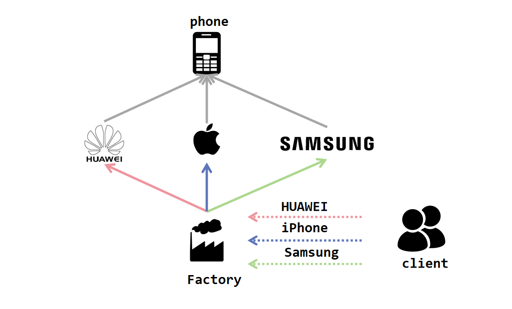
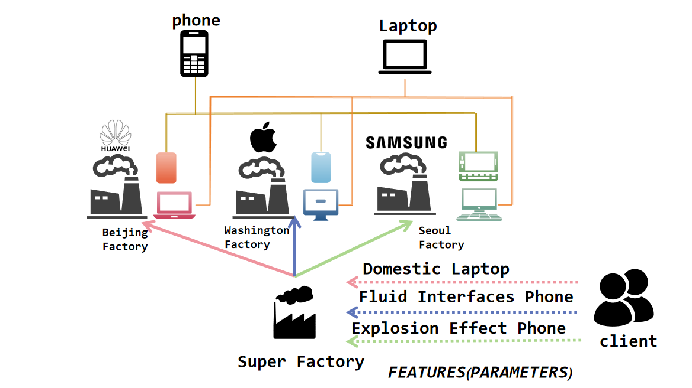

# 第七次作业指导书

## 第零部分：提交要求 && Junit要求

请保证提交项目的顶层目录存在两个文件夹：`src`和`test`（命名需严格与此保持一致），请将作业的**功能代码**存放于`src`文件夹下，同时将相关**junit测试类代码**文件存放于`test`文件夹下，以保证评测的正常进行（评测时**只会**针对`src`目录下的文件进行程序**功能**的评测以及代码风格检测，也就是说，`test`目录下的junit测试代码风格不会被检测）。参考目录结构如下：

```plaintext
|-src
  |- Bottle.java
  |- Equipment.java
  |- ...
|-test
  |- BottleTest.java
  |- EquipmentTest.java
  |- ...
```

本次作业，要求Junit测试覆盖率**保证**`method >= 90％`，`line >= 60%`，`branch >= 60%`。（`idea`显示的覆盖率和`评测`测到的覆盖率可能略有差别，请同学们以评测为准。同时请不要使用`assert`进行断言以免造成不必要的覆盖率损失）

## 第一部分：训练目标

- 掌握和理解设计模式的作用和意义
- 在作业中体验设计模式的理念

## 第二部分：预备知识

在之前的编程任务中，虽然同学们努力地完成了课下作业，但是同学们完成任务的方式或许在系统化、模块化和规范化方面有所欠缺。所以在本次作业中，我们希望同学们能亲身体验**设计模式**的理念，以更加工程化的方法来完成本次作业和未来的任务。

设计模式（Design pattern）代表了最佳的实践，是软件开发人员在软件开发过程中面临的一般问题的解决方案。这些解决方案是众多软件开发人员经过相当长的一段时间的试验和错误总结出来的。

设计模式是一套被反复使用的、多数人知晓的、经过分类编目的、代码设计经验的总结。使用设计模式是为了重用代码、让代码更容易被他人理解、保证代码可靠性。在我们学习面向对象的编程设计时，使用设计模式的结果是使代码编制真正工程化，设计模式是软件工程的基石，如同大厦的一块块砖石一样。

我们接下来会依次介绍**工厂模式**，**单例模式**和**观察者模式**

### 一、单例模式

**单例模式**是确保一个类只有一个实例，而且自行实例化并向整个系统提供这个实例。
> **<font size = 5><font color = "darkBlue">知识回顾-*实例*</font></font>**
>
> 实例指的是通过使用类创建的具体对象。它占用内存并持有对象的数据和方法。实例是真正存在的，可以执行各种操作和访问其属性。

#### 1.如何保证有且仅有一个实例？
该类的构造方法一定是 `private` 的，即不可以被外界进行实例化。且这个实例是属于当前类的静态成员变量。
``` java
public class Singleton {
    // 注意static
    private static Singleton singleton;
    
    // 注意private
    private Singleton(/*parameters*/) {
        /* ... */
    }
}    
```

#### 2.如何向整个系统提供这个实例？
该类应提供一个静态方法，能够向外界/系统提供当前类的实例
``` java
public static Singleton getInstance() {
        return singleton;
    }
```

#### 3.在什么时机进行该类单例的实例化？
+ 饿汉式：在类加载时就进行实例化
``` java
public class Singleton {
    private static Singleton singleton = new Singleton(/* paramters */);
}    
```

+ 懒汉式：在第一次使用时进行实例化
``` java
public class Singleton {
    private static Singleton singleton;
    
    /* ... */

    public static Singleton getInstance() {
        // 如果是第一次使用：
        if (singleton == null) {
            singleton = new Singleton(/* paramters */);
        }
        return singleton;
    }
}    
```
> 事实上，`getInstance()` 方法还需要注意多线程的同步问题，这部分等我们上OO正课时再进行了解。

### 二、工厂模式
工厂方法模式 (Factory Method Pattern) 又称为工厂模式，也叫虚拟构造器 (Virtual Constructor) 模式或者多态工厂 (Polymorphic Factory) 模式，它属于类创建型模式。

### 简单工厂模式
简单工厂模式 (Simple Factory Pattern):又称为静态工厂方法 (Static Factory Method) 模式，它属于类创建型模式。
在简单工厂模式中，可以根据参数的不同返回不同类的实例。简单工厂模式专门定义了一个类来负责创建其他类的实例，被创建的实例通常都具有共同的父类。


#### 1. 产品和其共同的父类
这个父类通常都是 **抽象类** ，就像我们在生产一个手机的时候，他不能只是一个手机，他一定是iPhone、Samsung、华为、小米……其中的一种。
>  **<font size = 5><font color = "darkBlue">知识补充-*抽象类*</font></font>**
> 抽象类可以被理解成一个可以包含普通方法和成员变量的接口，在被子类继承时可以选择性的*Override*抽象类的方法。
> 深入内容同学们可以课下自行了解。

``` java
public abstract class Product {
    private int price;

    public Product(int price) {
        this.price = price;
    }

    public abstract void use();

    public void information() {
        System.out.println(this.price);
    }
}
```
``` java
public class ProductA extends Product{
    public ProductA(int price) {
        super(price);
    }

    @Override
    public void use() {
        System.out.println("AAAA!");
    }
}
```
``` java
public class ProductB extends Product {
    public ProductB(int price) {
        super(price);
    }

    @Override
    public void use() {
        System.out.println("BBBB");
    }
}
```

#### 2.定义工厂来负责创建其他类的实例
``` java
public class Factory {
    public static Product create(String type) {
        if (type.equalsIgnoreCase("A")) {
            return new ProductA(100);
        } else if (type.equalsIgnoreCase("B")) {
            return new ProductB(200);
        } else {
            System.out.println("Wrong kind!");
            return null;
        }
    }
}
```

#### 3.生产产品
```java
public class MainClass {
    public static void main(String[] args) {
        Product productA = Factory.create("A");
        Product productB = Factory.create("B");
        Product productC = Factory.create("C");
        /* ... */
    }
}
```

### 工厂模式
工厂模式（Factory Pattern）中，我们定义一个用于创建对象的接口，让子类决定实例化哪个类。工厂方法使一个类的实例化延迟到其子类。
工厂模式和我们之前介绍过的简单工厂模式都属于面向对象设计方法中的创建型模式，它们的目标都是解决对象的创建过程。他们都用于创建对象，将对象的实例化与客户端代码分离。
但二者仍然有不同之处。
首先，二者的抽象程度不同：工厂模式更抽象，它通过定义一个抽象工厂接口和多个**实现工厂子类**来生产不同类型的产品；而简单工厂模式是由一个具体的工厂类负责创建所有的产品对象。
此外，二者在扩展性上也展示出不同特点。当新增一种产品时，工厂模式只需新增一个对应的工厂子类即可，而简单工厂模式在新增产品时需要修改原有的工厂类，这就违反了开闭原则。
>  **<font size = 5><font color = "darkBlue">知识补充-*开闭原则*</font></font>**
>  开闭原则(Open-Closed Principle, OCP)是指一个软件实体如类、模块和函数应该对扩展开放, 对修改关闭。通俗解释就是，添加一个新的功能，应该通过在已有代码(模块、类、方法)的基础上进行扩展来实现，而不是修改已有代码。
> 深入内容同学们可以课下自行了解。 

最后，就是工厂被调用的方式不同：工厂模式调用工厂接口来创建具体的产品对象；而简单工厂模式直接调用工厂类的静态方法，并传入一个参数来指定创建的具体产品类型。

通俗来讲，就是简单工厂模式是用一个厂生产多个产品，而工厂模式则是多个厂生产不同的产品。

#### 1.定义一个用于创建对象的接口
```java
public interface Factory {
    public Product creat(int price);
}
```
#### 2.让子类决定实例化哪个类
``` java
public class FactoryA implements Factory{
    @Override
    public Product creat(int price) {
        return new ProductA(price);
    }
}
```
``` java
public class FactoryB implements Factory{
    @Override
    public Product creat(int price) {
        return new ProductB(price);
    }
}
```
```java
public class MainClass {
    public static void main(String[] args) {
        Factory factoryA = new FactoryA();
        Factory factoryB = new FactoryB();
        factoryA.creat(100).use();
        factoryB.creat(200).use();
    }
}
```

### 抽象工厂模式
抽象工厂模式(Abstract Factory Pattern)：提供一个创建一系列相关或相互依赖对象的接口，而无须指定它们具体的类。抽象工厂模式又称为Kit模式，它是一种对象创建型模式。

如果说工厂模式只能构建同一品类/等级的产品，例如手机（iPhone HUAWEI Samsung…）。那么抽象工厂模式则支持了多种品类，例如手机、笔记本电脑、电视……它打破了工厂和产品一对一的关系，他满足一个具体的工厂类可以生产多个大类的产品


#### 1. 产品类
手机类产品：
```java
public abstract class Phone {
    private int price;

    public Phone(int price) {
        this.price = price;
    }

    public abstract void use();
}
```
```java
public class iPhone extends Phone{
    public iPhone(int price) {
        super(price);
    }

    @Override
    public void use() {
        System.out.println("APPLE iPhone!!!");
    }
}
```
```java
public class Honor extends Phone{
    public Honor(int price) {
        super(price);
    }

    @Override
    public void use() {
        System.out.println("HUAWEI Honor!!!");
    }
}
```
----
笔记本电脑类产品：
```java
public abstract class Laptop {
    private int size;

    public Laptop(int size) {
        this.size = size;
    }

    public abstract void use();
}
```
```java
public class iMac extends Laptop{
    public iMac(int size) {
        super(size);
    }

    @Override
    public void use() {
        System.out.println("APPLE iMac!!");
    }
}
```
```java
public class MateBook extends Laptop{
    public MateBook(int size) {
        super(size);
    }

    @Override
    public void use() {
        System.out.println("HUAWEI MateBook!!");
    }
}
```
#### 2. 工厂类
```java
public interface Factory {
    public Phone creatPhone(int price);
    public Laptop creatLaptop(int size);
}
```
```java
public class BJFactory implements Factory {
    @Override
    public Phone creatPhone(int price) {
        return new Honor(price);
    }

    @Override
    public Laptop creatLaptop(int size) {
        return new MateBook(size);
    }
}
```
```java
public class LAFactory implements Factory {
    @Override
    public Phone creatPhone(int price) {
        return new iPhone(price);
    }

    @Override
    public Laptop creatLaptop(int size) {
        return new iMac(size);
    }
}
```
#### 3. 客户端调取
```java
public class MainClass {
    public static void main(String[] args) {
        Factory Beijing = new BJFactory();
        Factory LosAngeles = new LAFactory();
        Beijing.creatPhone(8000).use();
        LosAngeles.creatPhone(11000).use();
        Beijing.creatLaptop(15).use();
        LosAngeles.creatLaptop(13).use();
    }
}
```
输出
```txt
HUAWEI Honor!!!
APPLE iPhone!!!
HUAWEI MateBook!!
APPLE iMac!!
```

### 三、观察者模式
观察者模式（Observer Pattern）是一种行为型设计模式，它定义了一种一对多的依赖关系，当一个对象的状态发生改变时，其所有依赖者都会收到通知并自动更新。

### 观察者模式解析
观察者--多 被观察者--1
我们举一个例子，同学们经常在B站看up主们发的视频，当我们关注的up主更新视频时，我们会收到他的更新通知……
#### 1.创建up主和用户接口
```java
public interface Uploader {
    public void addFollower(User follower); // 增加关注
    public void notifyFollowers(); // 通知所有关注用户
}
```
```java
public interface User {
    public void watch();
}
```
#### 2.实现up主和用户接口
```java
import java.util.ArrayList;

public class Up implements Uploader {
    // 管理观众们
    public ArrayList<User> followers = new ArrayList<>();
    // 更新状态 TRUE - 更新了 :) FALSE - 没更新 :(
    public boolean updatingStatus;

    @Override
    public void addFollower(User follower) {
        followers.add(follower);
    }

    @Override
    public void notifyFollowers() {
        followers.forEach(follower -> follower.watch(this));
        /* <==>
        for (User follower : followers) {
            follower.watch(this);
        }
        */
    }
}
```
```java
public class Follower implements User{
    private String name;

    public Follower(String name) {
        this.name = name;
    }

    @Override
    public void watch() {
        System.out.println(name + " is watching " + up.name + "'s channel");
    }
}
```
#### 3.被观察者状态改变 → 通知观察者！
```java
public class MainClass {
    public static void main(String[] args) {
        Uploader classmateHe = new Up("何同学");
        classmateHe.addFollower(new Follower("AAA"));
        classmateHe.addFollower(new Follower("BBB"));

        // 何同学更新了！
        classmateHe.notifyFollowers();
    }
}
```

```txt
AAA is watching 何同学's channel
BBB is watching 何同学's channel
```

## 第三部分：题目描述

### 背景

本次作业将是面向对象先导课程的最后一次迭代开发，与前面不同的是，本次作业将围绕的不是某些java语法知识点，而是一些面向对象的设计模式。

#### 价值新定义

本次作业新增金钱的概念，为冒险者的属性，在计算价值体的价值时，若该价值体为冒险者，**则需要，在将其所有价值体价值求和后增加其本身拥有的金钱**

#### 商店

在本次作业中，我们引入商店的概念。在作业中，商店将有且仅有一个。

为了防止直接删除造成的浪费，在指令3,5,8中，冒险者会选择不再直接删除物品（**注明，尝试使用空瓶所导致的丢弃不进行此改变，依旧选择不与商店接触的直接删除**），而是会去往商店售卖该物品，获得和其价值相等的金钱。（售卖后的物品不再参与后续行为，状态与之前作业中被删除后相同）同时，商店会对此次买入的基本类型名称和物品特征做记录。基本类型分为装备、药水瓶、食物三种。

冒险者可以通过输入的方式给商店提出购买需求（指令23），然后商店会按照当前自身的记录和购买的需求来卖给冒险者**新的物品**，商店的卖出行为 **不做任何记录**。此处的 **新的物品**代表该物品id不曾在当前程序运行中出现，可以认为商店在收到冒险者的购买需求后立刻新创造了一个符合需求的物品返回给冒险者

购买规则为：冒险者提供所需物品的 ID、名字和类型(如果类型非`RegularBottle` `Food` `RegularEquipment`三个普通物品之一，则会额外提供其对应特殊属性,详见输入说明部分)，商店对当前**该类型所属基本类型**的所有交易记录的金额求平均值并向下取整，得到价格A。假如冒险者当前的金钱数值大于等于A，则冒险者的金钱数值减少A，并且成功购买。否则购买失败，冒险者和商店状态不产生任何变化。

购买得到的物品属性满足:

- 若物品的类型属于药水瓶，则其容量为所有药水瓶交易记录的容量求平均并向下取整,默认为满
- 若物品的类型属于装备，则其星级为所有装备交易记录的星级平均并向下取整
- 若物品的类型属于食物，则其能量为所有食物交易记录的能量平均并向下取整
- 物品的价格为所有同基本类型交易记录的价格平均并向下取整

其中，类型指：`Food`，`RegularBottle`，`ReinforcedBottle`，`RecoverBottle`，`RegularEquipment`，`CritEquipment`，`EpicEquipment` 

基本类型包括药水瓶`Bottle`，食物`Food`,装备`Equipment`，在记录和计算交易价格时按照基本类型分类

#### 援助

在第六次作业作业的雇佣基础上，本次作业增加援助功能。

被冒险者A雇佣的冒险者们需要密切关注A的体力状态。当冒险者A进入战斗状态时，被A雇佣的冒险者们会记录A当前的体力。当冒险者A从此战斗状态退出后，若A当前体力值不大于进入战斗前的一半（该数值向下取整），假设A在此战斗模式种损失的体力为$a$,则所有被A雇佣的冒险者都会尝试给A  $a*10000$ 的金钱（假设某个被雇佣的冒险者持有的金钱少于此数值，则给A它剩余全部的金钱）**结算顺序按照进入战斗模式的顺序，例如，按照`adv_name_1`,`adv_name_2`的顺序进入战斗模式，则应按照`adv_name_1`,`adv_name_2`的顺序依次判断是否需要被援助并给予援助**

为了防止歧义：有且仅有通过18号指令才能建立雇佣关系，也即，若A雇佣B，B雇佣C，而A未在18号指令中雇佣C，则C不被视为被A雇佣的冒险者，C也不用在A退出战斗模式的时候给A金钱。）


### 操作要求

在本次作业中，初始时，你没有需要管理的冒险者，有且仅有一家没有任何记录的商店，我们通过若干条操作指令来修改当前的状态：

（**新增指令22~23，指令3,5,8意义有变，19-20行为有变**）

1. 加入一个需要管理的冒险者（新加入的冒险者不携带任何瓶子和装备，并且等级为1，初始体力为500，初始金钱为0）
2. 给某个冒险者增加一个瓶子
3. 卖出某个冒险者的某个瓶子
4. 给某个冒险者增加一个装备
5. 卖出某个冒险者的某个装备
6. 给某个冒险者的某个装备提升一个星级
7. 给冒险者增加一个食物
8. 卖出冒险者的一个食物
9. 冒险者尝试携带他拥有的某件装备
10. 冒险者尝试携带他拥有的某瓶药水
11. 冒险者尝试携带他拥有的某个食物
12. 冒险者使用某瓶药水
13. 冒险者使用某个食物
14. 进入战斗模式及战斗模式中所发生的事件
15. 查询战斗模式下某日期发生的事件
16. 查询战斗模式下某冒险者发起的攻击
17. 查询战斗模式下某冒险者受到的攻击
18. 一个冒险者雇佣另一个冒险者
19. 查询冒险者所拥有的价值体数量、价值体的价值总和
20. 查询冒险者所拥有的价值体中价值的最大值
21. 查询冒险者对应价值体的属性
22. 将冒险者携带的所有物品卖出
23. 冒险者尝试从商店购买一件物品

其中，卖出的意思是，冒险者失去该物品（对冒险者而言，和第二次作业到第六次作业的删除效果相同），同时，冒险者的金钱增加，增加的数值为该物品的价值，商店增加一条该物品的类型的记录。


### 输入格式

第一行一个整数 **n**，表示操作的个数。

接下来的 n 个指令，每条指令占一行，是一个形如 `{type} {attribute}` 的操作，`{type}` 和 `{attribute}` 间、若干个 `{attribute}` 间使用**若干**个空格分割，操作输入形式及其含义如下。战斗日志的内容同样每条占一行，但是**注意战斗日志内容不属于指令，指令数目n中不包含战斗日志占有的行数**

在**操作14中**，除了本身的指令占一行外，其余的fightLog每条占一行。保证操作14除了fightLog外所有`{type}` `{attribute}`均在一行内

| type | attribute                                                    | 意义                                                         | 输出（每条对应占一行）                                       |
| ---- | ------------------------------------------------------------ | ------------------------------------------------------------ | ------------------------------------------------------------ |
| 1    | `{adv_id} {name}`                                            | 加入一个 ID 为 `{adv_id}`、名字为 `{name}` 的冒险者          | 无                                                           |
| 2    | `{adv_id} {bot_id} {name} {capacity} {price} {type} {others}` | 给 ID 为 `{adv_id}` 的冒险者增加一个药水瓶，药水瓶的 ID、名字、容量、价值、类型、其他属性分别为 `{bot_id}`、`{name}`、`{capacity}`、`{price}`、`{type}`、`{others}`，关于其他属性在上文有具体定义，**且默认为已装满**(`isEmpty`==`false`) | 无                                                           |
| 3    | `{adv_id} {bot_id}`                                          | 将 ID 为 `{adv_id}` 的冒险者的 id 为 `{bot_id}` 的药水瓶卖出 | `{一个整数} {一个字符串}`，整数为卖出后冒险者药水瓶数目，字符串为删除的药水瓶的name |
| 4    | `{adv_id} {equ_id} {name} {star} {price} {type} {others}`    | 给 ID 为 `{adv_id}` 的冒险者增加一个装备，装备的 ID、名字、星级、价值、类型、其他属性分别为 `{equ_id}`、`{name}`、`{star}`、`{price}`、`{type}`、`{others}`，关于其他属性在上文有具体定义 | 无                                                           |
| 5    | `{adv_id} {equ_id}`                                          | 将 ID 为 `{adv_id}` 的冒险者的 id 为 `{equ_id}` 的装备卖出   | `{一个整数} {一个字符串}`，整数为卖出后冒险者装备数目，字符串为删除的装备的name |
| 6    | `{adv_id} {equ_id}`                                          | 将 ID 为 `{adv_id}` 的冒险者的 id 为 `{equ_id}` 的装备提升一个星级 | `{一个字符串} {一个整数}`，字符串为装备的name，整数为装备升星后的星级 |
| 7    | `{adv_id} {food_id} {name} {energy} {price}`                 | 给 ID 为 `{adv_id}` 的冒险者增加一个食物，食物的 ID、名字、能量、价值分别为 `{food_id}`、`{name}`、`{energy}`、`{price}` | 无                                                           |
| 8    | `{adv_id} {food_id}`                                         | 将 ID 为 `{adv_id}` 的冒险者的 id 为 `{food_id}` 的食物卖出  | `{一个整数} {一个字符串}`，整数为卖出后冒险者食物数目，字符串为删除的食物的name |
| 9    | `{adv_id} {equ_id}`                                          | ID 为 `{adv_id}` 的冒险者尝试携带ID为 `{equ_id}` 的装备      | 无                                                           |
| 10   | `{adv_id} {bot_id}`                                          | ID 为 `{adv_id}` 的冒险者尝试携带ID为 `{bot_id}` 的瓶子      | 无                                                           |
| 11   | `{adv_id} {food_id}`                                         | ID 为 `{adv_id}` 的冒险者尝试携带ID为 `{food_id}` 的食物     | 无                                                           |
| 12   | `{adv_id} {name}`                                            | ID 为 `{adv_id}` 的冒险者尝试使用他拥有的名字为`{name}`的药水瓶 | 成功：`{一个整数A} {一个整数B}`，整数A为该被使用药水瓶的id，整数B为该冒险者使用该药水瓶后的体力值                                                                                 失败： `fail to use {name}`(其中name为输入中的name) |
| 13   | `{adv_id} {name}`                                            | ID 为 `{adv_id}` 的冒险者尝试使用他拥有的名字为`{name}`的食物 | 成功：`{一个整数A} {一个整数B}`，整数A为该食物的id，整数B为该冒险者使用该食物后的等级                  失败：  `fail to eat {name}`(其中name为输入中的name) |
| 14   | `m k {adv_id_1} {adv_name_2} ` ...`{adv_name_m}`             | `m` 为进入战斗模式的人数，`k` 为此次战斗模式下战斗日志的条数，name 为 `{adv_name_j}` 的冒险者进入战斗模式，m,k和name均在同一行。接下来的 `k` 行均为战斗日志 | 首先第一行输出 `Enter Fight Mode` ，接下来 k 行输出 k 条战斗日志的反馈，参见下文关于战斗日志输出的表格 |
| 15   | `yyyy/MM`                                                    | 查询在 `yyyy/MM` 发生的有效战斗日志                          | 按输入的顺序每条日志输出一行：使用药水：`yyyy/MM {adv_name_1} used {name}`、一对一攻击：`yyyy/MM {adv_name_1} attacked {adv_name_2} with {name}`、一对多攻击：`yyyy/MM {adv_name_1} AOE-attacked with {name}`。如果不存在符合条件的日志，输出`No Matched Log` |
| 16   | `adv_id`                                                     | 查询 id 为 `adv_id` 的冒险者在战斗模式下作为**攻击者**的有效战斗日志 | 按输入的顺序每条日志输出一行：一对一攻击：`yyyy/MM {adv_name_1} attacked {adv_name_2} with {name}`、一对多攻击：`yyyy/MM {adv_name_1} AOE-attacked with {name}`。如果不存在符合条件的日志，输出`No Matched Log` |
| 17   | `adv_id`                                                     | 查询 id 为 `adv_id` 的冒险者在战斗模式下作为**被攻击者**的有效战斗日志 | 按输入的顺序每条日志输出一行：一对一攻击：`yyyy/MM {adv_name_1} attacked {adv_name_2} with {name}`、一对多攻击：`yyyy/MM {adv_name_1} AOE-attacked with {name}`。如果不存在符合条件的日志，输出`No Matched Log` |
| 18   | `{adv_id1} {adv_id2}`                                        | ID 为`adv_id1`的冒险者雇佣 ID 为`adv_id2`的冒险者，**对于多次出现的雇佣关系仅算作一次雇佣** | 无                                                           |
| 19   | `{adv_id}`                                                   | 查询 ID 为 `{adv_id}` 的冒险者所持有**价值体**的数量与价值之和<br/>如果价值体是装备、药水瓶或食物，则价值就是 `price`，对数量的贡献是 1 <br/>如果价值体是冒险者，则其价值计算按照本次作业最开始定义的规则，对数量的贡献也是 1，不需要考虑被雇佣冒险者所拥有的其他价值体 | `{一个整数 A} {一个整数 B}`，整数 A 表示某冒险者所拥有**价值体**数量，整数 B 表示某人所有**价值体**的价值总和 |
| 20   | `{adv_id}`                                                   | 查询 ID 为 `{adv_id}` 的冒险者所持有**价值体**的价值的最大值<br>如果价值体是装备、药水瓶或食物，则价值就是 `price` <br>如果价值体是冒险者，则其价值计算按照本次作业最开始定义的规则 | `{一个整数}`，表示该冒险者所持有**价值体**的价值的最大值，若不持有价值体则输出 `0` |
| 21   | `{adv_id} {com_id}`                                          | 查询 ID 为 `{adv_id}` 的冒险者所持有的 ID 为 `{com_id}` 的价值体所属类的类名 | 一个字符串 `Commodity whose id is {com_id} belongs to {x}`，其中`{com_id}`为价值体的 ID，`{x}` 为 `Adventurer`，`Food`，`RegularBottle`，`ReinforcedBottle`，`RecoverBottle`，`RegularEquipment`，`CritEquipment`，`EpicEquipment`中价值体所属类的类名 |
| 22   | `{adv_id}`                                                   | ID为`{adv_id}`的冒险者卖出它携带的所有物品                   | `{冒险者name} emptied the backpack {一个整数}`，整数表示本次卖出所有携带物品所获得的金钱之和 |
| 23   | `{adv_id}`  `{id}` `{name}` `{type}` `{others}`              | ID为`{adv_id}`的冒险者尝试购买ID为`{id}` 的物品，其名字为`{name}`该物品的属性为`{others}` | 购买成功：`successfully buy {name} for {购买价格}`                                                                  购买失败：`failed to buy {name} for {购买价格}` |

保证`{others}`的输入和`{adv_id}`  `{id}` `{name} ` `{type}`在同一行内。

同时，在19号的查询中，**自己所拥有的金钱不算自己持有的价值体，因此不用计算在内**，这一点和计算冒险者价值时有所不同，希望同学们注意。


#### 关于战斗日志的具体说明

| 输入格式                                   | 意义                                                         | 输出格式                                                     |
| ------------------------------------------ | ------------------------------------------------------------ | ------------------------------------------------------------ |
| `yyyy/MM-{adv_name_1}-{name}`              | 在 `yyyy/MM`这个月，名字为 `{adv_name_1}` 的冒险者使用了名字为 `{name}` 的药水 | 成功：一个整数A+一个空格+一个整数B，整数A为该被使用药水的id，整数B为该冒险者使用该药水后的体力值                                                                                失败： "Fight log error" |
| `yyyy/MM-{adv_name_1}@{adv_name_2}-{name}` | 在 `yyyy/MM`这个月，名字为 `{adv_name_1}` 的冒险者对名字为 `{adv_name_2}` 的冒险者发起攻击，使用了名字为 `{name}` 的装备 | 成功：一个整数A+一个空格+一个整数B，整数A为**被攻击者**的id，整数B为该冒险者受到攻击后的体力值                                                                                失败： "Fight log error" |
| `yyyy/MM-{adv_name_1}@#-{name}`            | 在 `yyyy/MM`这个月，名字为 `{adv_name_1}` 的冒险者对名字为 剩余所有冒险者发起群体攻击，使用了名字为 `{name}` 的装备 | 成功：按照  进入战斗状态 的次序输出受攻击冒险者被攻击后的体力值，以一个空格隔开                                                                  失败： "Fight log error" |

上述 "Fight log error" 的输出场景为：**非法冒险者名**（冒险者不处于战斗模式）、**非法药水名**（该药水未被携带）、**非法武器名**（该武器未被携带）。保证战斗日志不会出现其他形式的错误。一旦出现错误，**则该行战斗日志无效**，不产生任何作用，同时 **不应出现在15/16/17号命令的查询中**

特别地，对于一对多攻击，只要出现上述错误场景，视这条战斗日志无效，所有被攻击者均不会损失体力。

`yyyy/MM`代表输入的字符串位数必然为4位数字/2位数字，你在输出的时候也应当采取这样的格式

### 购买指令(23)不同物品的{others}输入

下表展示了23号指令中`{others}`不同类型对应的输入，无代表没有`{others}`部分的输入，`{}`内的变量符合数据限制中的要求

| type               | others       |
| ------------------ | ------------ |
| `RegularBottle`    | 无           |
| `RecoverBottle`    | `{ratio}`    |
| `ReinforcedBottle` | `{ratio}`    |
| `RegularEquipment` | 无           |
| `CritEquipment`    | `{critical}` |
| `EpicEquipment`    | `{ratio}`    |
| `Food`             | 无           |

### 样例
##### 输入
```
11
1 123 advName
7 123 1 foodName 11 10000
4 123 2 equName 10 20000 RegularEquipment
2 123 3 botName 10 30000 RegularBottle
2 123 11 botName2 10 55000 RegularBottle
10 123 11
10 123 3
22 123
23 123 5 bot RegularBottle
23 123 6 bot RegularBottle
23 123 7 bot RegularBottle
```
##### 输出
```
advName emptied the backpack 85000
successfully buy bot for 42500
successfully buy bot for 42500
failed to buy bot for 42500
```

### 数据限制

##### 变量约束

| 变量       | 类型   | 说明                                                |
| ---------- | ------ | --------------------------------------------------- |
| `id `      | 整数   | 取值范围：0 - 2147483647                            |
| `name`     | 字符串 | 保证不会出现空白字符, `@`, `-`, `#` ,长度范围(0,40)    |
| `capacity` | 整数   | 取值范围：1 - 2147483647                            |
| `star`     | 整数   | 取值范围：0 - 2147483647                            |
| `level`    | 整数   | 取值范围：1 - 2147483647                            |
| `hitPoint` | 整数   | 取值范围：1 - 2147483647                            |
| `energy`   | 整数   | 取值范围： 0-2147483647                             |
| `ratio`    | 浮点数 | 0 < `ratio` < 1，double 精度范围内                  |
| `price`    | 长整数 | 所有价值体的价值均在 long 精度范围内，且保证不小于0 |
| `critical` | 整数   | 取值范围：0 - 2147483647                            |
| `money`    | 长整数 | long 精度范围内，且保证不小于0                      |
| `type`     | 字符串 | 出现时必定为`Adventurer`，`Food`，`RegularBottle`，`ReinforcedBottle`，`RecoverBottle`，`RegularEquipment`，`CritEquipment`，`EpicEquipment` 中的一个 |

表格中a-b指变量范围为[a,b]

注意，变量约束指的是，在程序正确运行时，输入和对应属性值均保证在表格中给出的范围内

在本次作业的数据中**不会**存在money的实际值超过long范围的情况，但是如果一个情景存在超过long的需求呢？请同学们自行了解Java中的BigInteger类，以应对今后学习工作中的情况。

##### 操作约束

1. **保证所有的冒险者、药水瓶、装备、食物 id 均不相同，冒险者之间的name均不相同**
2. 保证删除了的药水瓶/装备/食物的 id 不会再次出现
3. 2-6/14/16-17保证所有 id 对应的冒险者均已存在
4. 3/5/6/8 保证该冒险者拥有操作中提到 id 的药水瓶/装备/食物
5. 保证增加的装备，食物和药水瓶原本不存在
6. 操作数满足1≤*n*≤2000
7. 9-11保证该冒险者拥有操作中提到 id 的药水瓶/装备/食物
8. 12-13 **不**保证以提到的 name 为名字的物品已经被携带
9. 14保证战斗模式结束时，任意一个冒险者的体力均大于0
10. 保证战斗日志出现的时候一定处于战斗模式
11. 同一次战斗模式下，保证日志输入中日期随输入顺序**单调不减**；如果多次进入战斗模式，进入战斗模式的日期也随输入顺序**单调不减**
12. 保证 14 中所有 name 均存在，18-21 中所有 id 均存在，21 中冒险者一定拥有对应 id 的价值体
13. 保证不会出现两个或多个冒险者之间循环雇佣的情况
14. 保证单个数据点内冒险者数目不会超过15
15. 保证冒险者从商店购买该类型物品前已经有对该类型物品的购买记录
16. 23保证购买物品的 id 原本不存在
