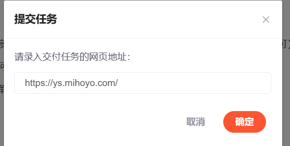
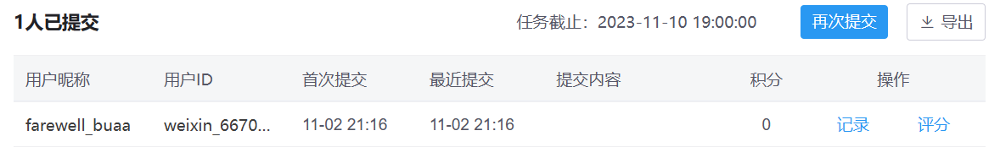

# 第八次作业指导书

本次作业是2023年面向对象先导课程的最后一次作业。

在这次作业中，我们没有需要迭代开发的功能，而是希望同学们把目光着眼于自己已经写过的程序：我们希望同学们能够学习一些优秀的同学的代码，同时对本学期所学的内容进行总结反思，为正课做好准备。

*   **前言提醒**：
    *   请大家先加入csdn班级社区：[点击此处链接](https://bbs.csdn.net/forums/oopre_2023?joinKey=nr2dl5ye4qry-jl6q63mvny-1-268291134511a8db42a0b9b39c0a2e1b&roleId=768397) 即可加入班级社区
    *   加入班级社区后请修改【昵称】为【姓名-学号】

    *   在[csdn班级社区](https://bbs.csdn.net/forums/oopre_2023)中发布。

## 作业简介

在公共仓库中提供了几份同学的代码，它们均在前面的测试中获得了优秀的成绩，并且在代码组织和设计思想上有可以学习的地方。同学们可以下载阅读，并思考自己代码可以改进的地方、组织架构可以优化的地方。并按照下述要求撰写博客，提交至csdn社区。

大家的博客需要包含以下内容：

1. 作业最终的架构设计, 在迭代中的架构调整及考虑
2. 使用junit的心得体会
3. 学习oopre的心得体会（包括但不限于从面向过程编程过渡到面向对象编程的体会）
4. 对oopre课程的简单建议（不多于两条）

## 作业提交方式

首先需要你自己的csdn账号写一个博客然后通过审核。

当你进入到我们csdn的作业提交处(链接在下面博客要求的第四点)，你将在作业内容的下面看到下图这个框，当然，当你看到这段文字的时候，很可能里面已经有内容了。

有提交任务，点一下

把你的博客链接贴上来，这里作为示范，我贴一个网站上去：

点确定：

提交成功。

当然，由于我们提交的东西会先经过csdn的 审核，所以一开始并不能看见你交了啥，只有一个：

这里就需要你费心点，多看什么时候显示提交内容，确保从这里能进入到你的博客了，才能算作提交成功。

## 博客要求

1. **不得抄袭**
2. 在保证内容有意义的情况下不要求字数多（字数过多会对你的博客评分产生负面影响，阐明博客内容要求中的点即可），但是过于敷衍的作业内容可能会对博客分数造成明显影响。
3. 及时提交。在截止时间后收到的博客将不会获得任何博客分数。
4. **注意**：在编写完博客并发布在CSDN之后，请在[对应作业处](https://bbs.csdn.net/topics/617509532)选择要作为作业提交的博客，点击提交
