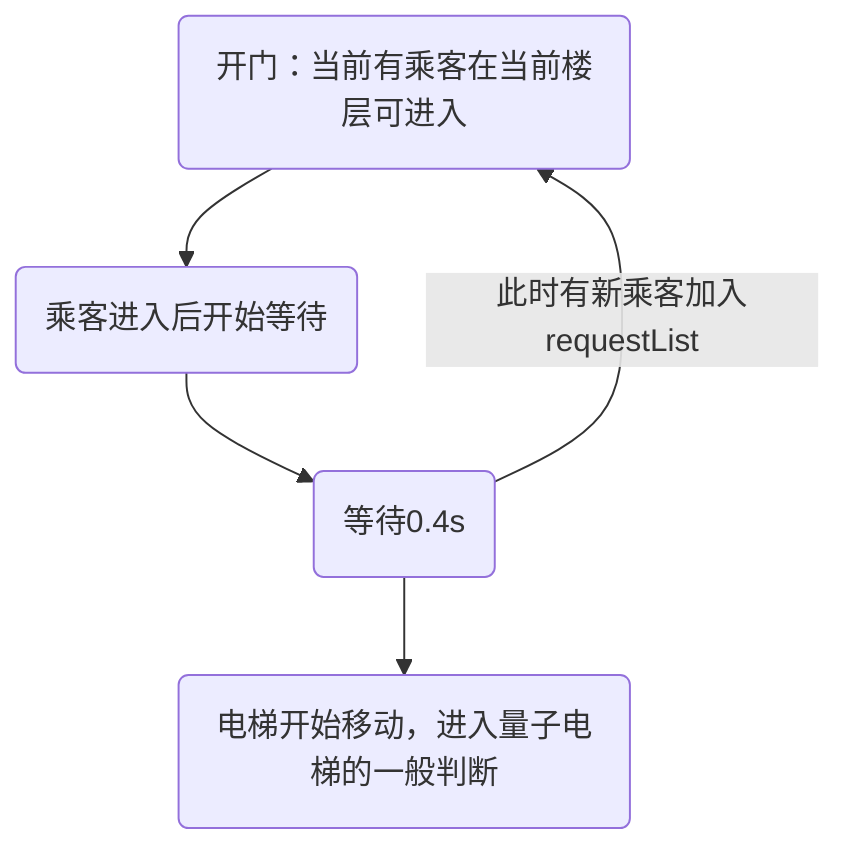

# 等一会再关门——一种优化的量子电梯策略

> 叠甲：量子电梯是Hack评测机制的一种优化方式，纯粹是为了让性能分更好看，在实际生活中没有任何意义。本文旨在探讨如何优化一种虚拟电梯的表现。

关于基本量子电梯的部分，可以参考[往年博客](https://www.cnblogs.com/kasuganokusa/p/14701724.html)和[wjj同学的这篇博客](http://oo.buaa.edu.cn/assignment/510/discussion/1533)，可以得到对于量子电梯的基本实现思路。

量子电梯的核心观点就是：将电梯的实际运行和对外的输出表现进行分离，如果在电梯上升的这段时间内有新乘客可以在此楼层加入电梯，那么就打断原先的上升过程（对外表现是什么都不做的`sleep(400)`），改为开门操作。

这是量子电梯的一种基本思路，在实现后，很容易发现还有优化的空间：目前的策略是只要有乘客加入就开门，从原先的运动状态转移为开门进客状态。

但是开门-关门这个中间过程是无法打断的（对于我看到的绝大部分博客），造成了如果间隔0.1s上客，那么会反复地进行开门、关门，造成时间无意义的损耗。

本文的优化思路就是**对开关门过程进行打断**。

## 实现

怎么打断？

明确一下电梯开关门规则：

1. 关门时间 - 开门时间 > 0.4s
2. 运行前一定要关门

首先，开门是有乘客加入，如果同时投放自然不用说。但是问题在于间隔投放中等待的价值，我的基本取舍在于，每次进课后等待0.4s，这期间如果又有新乘客进入，则打断该等待过程，回到进客状态。用状态机来表现就是：



实际的代码中会对开关门行为做出优化：

1. 进入进客阶段：
   1. 如果当前没开门，开门并输出
   2. **如果已经开门了，无行为**
2. 进客完成后等待：
   1. 如果有新进客，则返回`run()`，重复过程
   2. 否则进入关门阶段
3. 关门并输出

```java
// ElevatorThread.java
private void QuantMove() {
    while (System.currentTimeMillis() < beginTime + 400) {
        //如果下一个状态可开门进客，则返回run()
        if (nextStatus == Status.IN) {
            return;
        }
    }

    //...
    this.elevator.Move();
}

private void InPassenger() {
    //...
    Status nextStatus;
    synchronized (this.requestQueue) {
        // 正常的进客
        // 利用wait等待可能的进客
        this.WaitLeftTime(openTime);
        nextStatus = Strategy.GetAdvice(this.elevator, this.requestQueue);
    }
    if (nextStatus == Status.IN) {
        return;
    }

    // 开了一定要关
    this.elevator.CloseDoor();
}
```

## 取舍

如果反复开关门，没进一次至少需要0.4s，那么进客后等待0.4s实际上没有付出多余时间，只是将开关门时间转换为了等待时间。

实际结果中，对于具有特征的数据，这样的优化能取得较好的效果：

```
[1.0]1-FROM-1-TO-6-BY-2
[1.3]2-FROM-1-TO-6-BY-2
[1.6]3-FROM-1-TO-6-BY-2
[1.9]4-FROM-1-TO-6-BY-2
[2.2]5-FROM-1-TO-6-BY-2
[2.6]6-FROM-1-TO-6-BY-2
```

结果：

```
[   1.0160]OPEN-1-2
[   1.0170]IN-1-1-2
[   1.2960]IN-2-1-2
[   1.5960]IN-3-1-2
[   1.8950]IN-4-1-2
[   2.2080]IN-5-1-2
[   2.5960]IN-6-1-2
[   2.9970]CLOSE-1-2
[   3.4070]ARRIVE-2-2
[   3.8120]ARRIVE-3-2
[   4.2260]ARRIVE-4-2
[   4.6350]ARRIVE-5-2
[   5.0360]ARRIVE-6-2
[   5.0360]OPEN-6-2
[   5.0360]OUT-1-6-2
[   5.0360]OUT-2-6-2
[   5.0380]OUT-3-6-2
[   5.0380]OUT-4-6-2
[   5.0380]OUT-5-6-2
[   5.0380]OUT-6-6-2
[   5.4380]CLOSE-6-2
```
